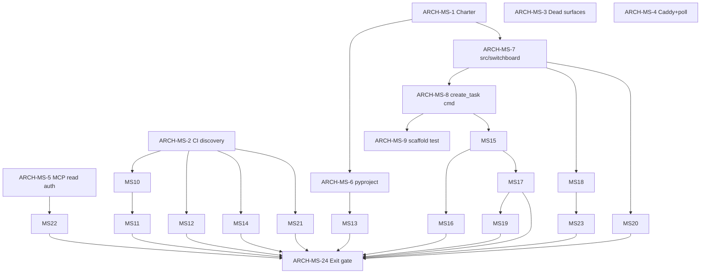

# ARCH-MS execution tracker — platform modernization (Phase 0 → Phase 3)

**Phase 0 charter:** [ADR-0009](decisions/0009-microservices-modernization.md)  
**Phase 2 charter:** [ADR-0011](decisions/0011-phase2-process-strangler.md)  
**Phase 3 charter:** [ADR-0012](decisions/0012-phase3-tasks-process-strangler.md)  
**Board:** `project=switchboard` · workstream **ARCH-MS**  
**Deliverables:** `arch-ms-phase-0` · `arch-ms-phase-1` (modular monolith exit) · `arch-ms-phase-2` · `arch-ms-phase-3`

> **Ratchet retired 2026-07-12.** `test_size_ratchet.py` (the exact-match size gate) was deleted —
> it forced every concurrent PR to compare-and-swap one shared integer against a moving `master`,
> which produced the merge wars that stalled the fleet. Growth is now redirected by ADR-0007
> Decision 3 + review; the Phase 0 progress metric is **lines extracted**, not a ceiling. Net
> monolith growth is enforced commutatively by the per-PR `test_monolith_diff_guard.py`
> (HARDEN-69 / ADR-0010 Lever 1) — no shared counter. See ADR-0007 Decision 2 (retired) and
> ADR-0009 Decision 5 #4.

**Canonical main (Phase 0 tracker baseline):** `5305090` (2026-07-12)  
**Phase 0 view:** [`?project=switchboard&deliverable=arch-ms-phase-0#tab-mission`](https://plan.taikunai.com/?project=switchboard&deliverable=arch-ms-phase-0#tab-mission)  
**Phase 2 view:** [`?project=switchboard&deliverable=arch-ms-phase-2#tab-mission`](https://plan.taikunai.com/?project=switchboard&deliverable=arch-ms-phase-2#tab-mission)  
**Phase 3 view:** [`?project=switchboard&deliverable=arch-ms-phase-3#tab-mission`](https://plan.taikunai.com/?project=switchboard&deliverable=arch-ms-phase-3#tab-mission)

---

## Phase 3 — Tasks process strangler (service #2, cut conditional) — Mode A

**Charter:** [ADR-0012 — Phase 3 Tasks process strangler](decisions/0012-phase3-tasks-process-strangler.md)  
**Deliverable:** `arch-ms-phase-3`  
**Mission end state:** Tasks either runs as its own uvicorn behind Caddy (Path A) or stays
in-process with documented No-Go (Path B). No half-cut. Phase 2 Auth cut remains green. Thin
day-one surface only (`:8122`; `/api/tasks*` + claim-only TXP). Deploy stays FastAPI + uvicorn +
Caddy; SQLite default (Postgres only via ARCH-19 SLO).

| Milestone | Intent |
|---|---|
| `3a-charter-rails` | ADR-0012 + Phase 3 exit harness (ARCH-MS-85…86) |
| `3b0-tasks-independence` | Ports, writers/Auth binding, ops proof + Go/No-Go (ARCH-MS-87…89) |
| `3b-tasks-process-cut` | Conditional Tasks uvicorn cut (ARCH-MS-90…92) — **Go only** |
| Exit | `arch_ms_phase3_exit_gate` — Tasks cut **or** documented No-Go; Auth Path A still green |

**Hard rules (see ADR-0012):** one BC (Tasks); yellow-light cut; reuse Auth playbook; Mode A thin
surface; explicit No-Go keep-in-process exit; no nginx; no MCP/other-BC cuts in this phase.

| Task | Title | Tracker | Repo evidence |
|---|---|---|---|
| **ARCH-MS-85** | 3A: ADR — Phase 3 Tasks process strangler charter (Mode A) | 🟡 | `docs/decisions/0012-phase3-tasks-process-strangler.md` |
| **ARCH-MS-86** | 3A: Phase 3 exit gate harness | 🟡 | `scripts/arch_ms_phase3_exit_gate.py`; `tests/test_arch_ms86_phase3_exit_gate.py` |
| **ARCH-MS-87** | 3B0: Tasks ports — remove store/auth/dispatch imports | 🟡 | `services/tasks` ports + `tasks_port_adapters`; `tests/test_arch_ms87_tasks_ports.py`; tasks forbidden-import ratchet |
| **ARCH-MS-88** | 3B0: Tasks ownership, writers, Auth binding via ports | 🟡 | `docs/TASKS-INDEPENDENCE-GATE.md`; `services/tasks/binding.py`; `tests/test_arch_ms88_tasks_ownership.py` |
| **ARCH-MS-89** | 3B0: Tasks ops proof harness + Go/No-Go verdict | 🟡 | `scripts/arch_ms89_tasks_ops_proof.py`; `docs/phase3/tasks_independence_verdict.json`; `tests/test_arch_ms89_tasks_ops_proof.py` |
| **ARCH-MS-90** | 3B: Extract Tasks as standalone uvicorn (**Go only**) | ✅ | PR #522 — `services/tasks/{app,settings,health}` Mode A `:8122` |
| **ARCH-MS-91** | 3B: Tasks side-by-side `:8122` + parity (**Go only**) | ✅ | PR #524 — `tests/test_arch_ms91_tasks_parity.py` |
| **ARCH-MS-92** | 3B: Caddy cutover + dual-strip for Tasks (**Go only**) | 🟡 | live `deploy/Caddyfile` Mode A → `:8122`; `deploy/switchboard-tasks.service`; `PM_TASKS_HTTP_PRIMARY=service` |
| **ARCH-MS-93** | Exit: Phase 3 close — Tasks cut conditional | 🟡 | Path A — `tasks_independence_verdict.json` (go+G6); exit gate Path A |

Update the **Repo evidence** column when a PR merges. Board status follows Switchboard provenance
rules — agents use `complete_claim`; Done requires merge webhook or reconcile.

---

## Phase 2 — process strangler (auth-first, cut conditional)

**Charter:** [ADR-0011 — Phase 2 process strangler](decisions/0011-phase2-process-strangler.md)  
**Deliverable:** `arch-ms-phase-2`  
**Mission end state:** Safe service-cut playbook proven. Auth process cut only if the
independence gate (ARCH-MS-82…84) records Go; otherwise Auth stays in-process. Never convert
in-process coupling into network coupling. Deploy stays FastAPI + uvicorn + Caddy; SQLite
default (Postgres only via ARCH-19 SLO).

| Milestone | Intent |
|---|---|
| `2a-charter-rails` | ADR-0011 + reusable service skeleton + exit harness (ARCH-MS-72…74) |
| `2b0-auth-independence-gate` | Ports, ownership/outage/secrets, ratchets + ops proof (ARCH-MS-82…84) |
| `2b-auth-process-cut` | Conditional Auth uvicorn cut (ARCH-MS-75+) — **Go only** |
| Exit | `arch_ms_phase2_exit_gate` — Auth cut **or** documented No-Go + ratchets + Tasks readiness |

**Hard rules (see ADR-0011):** one bounded context per cut; green façade always; Auth = service
#1, Tasks = #2; yellow-light Auth cut; explicit No-Go keep-in-process exit; no nginx; no
big-bang rewrite / frontend swap.

| Task | Title | Tracker | Repo evidence |
|---|---|---|---|
| **ARCH-MS-72** | 2A: ADR — Phase 2 process strangler charter | ✅ | PR #490 — `docs/decisions/0011-phase2-process-strangler.md` |
| **ARCH-MS-73** | 2A: Service skeleton — FastAPI + health + systemd/Caddy | ✅ | PR #493 — `src/switchboard/services/_skeleton/`; `deploy/skeleton/` |
| **ARCH-MS-74** | 2A: Phase 2 exit gate harness | ✅ | PR #497 — `scripts/arch_ms_phase2_exit_gate.py`; `tests/test_arch_ms74_phase2_exit_gate.py` |
| **ARCH-MS-82** | 2B0: Auth ports — remove store/auth/notify imports | ✅ | PR #492 — ports + adapters; `tests/test_arch_ms82_auth_ports.py` |
| **ARCH-MS-83** | 2B0: Auth ownership, outage policy, secrets fail-fast | ✅ | PR #495 — `docs/AUTH-INDEPENDENCE-GATE.md`; `ensure_identity`; JWT secret fail-fast |
| **ARCH-MS-84** | 2B0: Architecture ratchets + Auth cut ops proof | ✅ | PR #498 — `scripts/arch_ms84_*`; gate G2/G5 measured |
| **ARCH-MS-75** | 2B: Extract Auth as standalone uvicorn (**Go only**) | ✅ | PR #501 — `src/switchboard/services/auth/`; side-by-side `:8121` |
| **ARCH-MS-76** | 2B: Caddy + systemd cutover for Auth (**Go only**) | ✅ | PR #503 — live `deploy/Caddyfile` `/api/auth*` → `:8121`; `deploy/switchboard-auth.service` |
| **ARCH-MS-77** | 2B: Auth cutover parity tests + strip dual impl (**Go only**) | ✅ | PR #505 — hermetic parity; `PM_AUTH_HTTP_PRIMARY=service`; `/api/auth/me*` → `:8110` |
| **ARCH-MS-78** | 2C: Tasks service readiness — contracts + extract plan | ✅ | PR #506 — `docs/ARCH-MS-PHASE2-TASKS-READINESS.md` + `docs/phase2/tasks_readiness.md` (readiness-only) |
| **ARCH-MS-79** | 2C: Tasks process cut (optional) | 🟡 | **Waived** — `docs/phase2/tasks_cut_waived.md`; exit via readiness (ADR-0011 2C) |
| **ARCH-MS-81** | Exit: Phase 2 close — Path A evidence | ✅ | PR #510 — `docs/phase2/auth_independence_verdict.json` (go) + `docs/phase2/auth_cut_playbook.md`; exit gate `passed=true` |

Update the **Repo evidence** column when a PR merges. Board status follows Switchboard provenance
rules — agents use `complete_claim`; Done requires merge webhook or reconcile.

---

## Phase 0 — platform modernization

**Mission end state:** ADR-007 rails complete; `src/switchboard/` scaffold live; one REST+MCP pair
uses `application/` commands; new feature code lands in `src/switchboard/`, not the monoliths.

## How to use this doc

| Symbol | Meaning |
|---|---|
| ⬜ Not started | No merged repo work for this task |
| 🟡 In progress | Claimed, partial land, or open PR |
| ✅ Done (repo) | Merged on canonical `master` with identifiable evidence |
| 🔗 Shipped elsewhere | Requirement met by a non-ARCH-MS task (evidence linked) |

Update the **Repo evidence** column when a PR merges. Board status (`Not Started` / `In Progress` /
`In Review` / `Done`) follows Switchboard provenance rules — agents use `complete_claim`; Done
requires merge webhook or reconcile.

---

## Milestones

| ID | Title | Intent |
|---|---|---|
| `m0-enforcement` | 0.1 Enforcement (ADR-0007) | Ratchet, CI discovery, dead-surface deletion, Caddy + poll parity, census |
| `m0-scaffold` | 0.2 Scaffold (`src/switchboard/`) | Package skeleton, `application/` commands, REST/MCP adapters, CI proof gate |
| `m0-security` | 0.3 Security P0 | MCP read auth, readiness probe hygiene |

---

## Task table (ARCH-MS-1 … ARCH-MS-24)

| Task | Title | Milestone | Deps | Board | Tracker | Repo evidence |
|---|---|---|---|---|---|---|
| **ARCH-MS-1** | ADR-0009 charter + ARCH-MS-EXECUTION tracker | 0.2 | — | Done | ✅ | PR #314 — `docs/decisions/0009-microservices-modernization.md`, `docs/ARCH-MS-EXECUTION.md` |
| **ARCH-MS-2** | CI test discovery (CONSOL-6); size ratchet **retired** | 0.1 | — | Done | ✅ | PR #345 — `scripts/switchboard_ci.sh` runs every `test_*.py` via discovery + `TEST_DENYLIST`; the shared-counter ratchet was retired. |
| **ARCH-MS-3** | Delete dead MCP/REST surfaces (CONSOL-7, CONSOL-9) | 0.1 | — | Done | ✅ | **CONSOL-7** PR #276 + `test_consol7_dead_surfaces.py`; **CONSOL-9** PR #297 + `test_consol9_h2_census.py`. `gmail_source.py` deferred → ARCH-MS-11 |
| **ARCH-MS-4** | Caddy security headers + mission poller ETag (CONSOL-8) | 0.1 | — | Done | ✅ | **CONSOL-8** PR #286 + `test_consol8_edge_mission_poll.py`. `deploy/Caddyfile` security headers + access log; `app.py` mission_status / dependency_graph `max_age=5` + ETag; ack poll visibility guard |
| **ARCH-MS-5** | MCP read auth — bearer required on `/mcp` | 0.3 | — | Done | ✅ | **BUG-46** / PR #273 — `mcp_auth.py` + `MCPAuthMiddleware`; `test_mcp_read_auth.py`; prod `PM_AUTH_MODE=required` |
| **ARCH-MS-6** | `pyproject.toml` package scaffold (lockfile pending) | 0.2 | 1 | Done | ✅ | **HARDEN-54** PR #303 + `tests/test_arch_ms6_pyproject_scaffold.py`. `pyproject.toml`, `.python-version`, generated `requirements*.txt`; lockfile → ARCH-MS-13 |
| **ARCH-MS-7** | `src/switchboard/` package skeleton | 0.2 | 1 | Done | ✅ | PR #319 — `src/switchboard/` package tree + `settings.py` + `scripts/switchboard_path.py` |
| **ARCH-MS-8** | `create_task` application command + REST/MCP wire | 0.2 | 7 | Done | ✅ | PR #324 — REST and MCP share the typed `create_task` application command |
| **ARCH-MS-9** | `test_arch_ms0_scaffold` CI gate | 0.2 | 7, 8 | Done | ✅ | PR #331 — `tests/test_arch_ms0_scaffold.py`; auto-discovered by `scripts/switchboard_ci.sh` |
| **ARCH-MS-10** | `PM_*` env flag census + delete unread flags | 0.1 | 2 | Done | ✅ | PR #329 — `scripts/pm_env_flag_census.py`; `tests/test_pm_env_flag_census.py`; tracked declarations fail closed when unread; CONSOL-9 deletion tombstones retained |
| **ARCH-MS-11** | Extract inbox routing; retire `gmail_source.py` | 0.1 | 10 | Done | ✅ | PR #338 — `src/switchboard/integrations/inbox_routing.py`; `inbox_source.py`; `tests/test_arch_ms11_inbox_routing.py` |
| **ARCH-MS-12** | Numbered transactional DB migrations | 0.1 | 2 | Done | 🔗 | **BUG-47** / PR #301 — ledgered migrations; `test_schema_migrations.py` |
| **ARCH-MS-13** | Lockfile + Python 3.12 pin (reproducible builds) | 0.1 | 6 | Done | ✅ | **HARDEN-54** PR #303 + PR #342 / `tests/test_arch_ms13_reproducible_builds.py` — lock metadata, artifact hashes, Python floor, and generated exports fail closed in CI |
| **ARCH-MS-14** | `tests/` directory + path shim for new tests | 0.1 | 2 | Done | ✅ | PR #340 — `tests/path_setup.py`; `tests/test_arch_ms14_test_layout.py`; new tests share the root + `src/` bootstrap |
| **ARCH-MS-15** | `get_task` query + `update_task` application command | 0.2 | 8 | Done | ✅ | PR #335 — shared get-task query and update-task application command |
| **ARCH-MS-16** | `api/routers/tasks.py` — extract task REST routes | 0.2 | 15 | Done | ✅ | PR #347 — `src/switchboard/api/routers/tasks.py`; complete `/api/tasks...` surface; `tests/test_arch_ms16_task_router.py` |
| **ARCH-MS-17** | `mcp/tools/tasks.py` — extract task MCP tools | 0.2 | 15 | Done | ✅ | PR #344 — task tools register from the package adapter; direct Python callers retain compatibility aliases |
| **ARCH-MS-18** | Migrate `services/auth` → `api/routers/auth` | 0.2 | 7 | Done | ✅ | PR #326 — auth package moved to `src/switchboard/api/routers/auth`; app and tests use the package seam |
| **ARCH-MS-19** | `mcp/tools/board.py` — first MCP tool module pattern | 0.2 | 17 | Done | ✅ | PR #348 — board summary, delta, project discovery, and plan signals register from the package adapter |
| **ARCH-MS-20** | `runner_*` → `runner_store.py` leaf extraction | 0.2 | 7 | Done | ✅ | PR #323 — 441 monolith lines moved into the 480-line `runner_store.py` leaf |
| **ARCH-MS-21** | Split `static/app.js` → `static/js/{api,state,board,mission}` | 0.2 | 2 | Done | ✅ | PR #334 — `static/app.js` composition root + `static/js/{api,state,board,mission}.js` |
| **ARCH-MS-22** | `/health/deep` — stop leaking project identifiers | 0.3 | 5 | Done | 🔗 | **BUG-48** / PR #299 |
| **ARCH-MS-23** | Global auth cutover — remove `PM_GLOBAL_AUTH` gate | 0.3 | 18 | Done | 🔗 | **ACCESS-16** / PR #300 deleted the legacy login + flag; PR #327 guards against regression |
| **ARCH-MS-24** | Phase 0 exit gate — extraction proof + application layer proven | 0.2 | 11,12,13,14,16,17,19,20,21,22,23 | In Review | 🟡 | `scripts/arch_ms_phase0_exit_gate.py`; `tests/test_arch_ms24_phase0_exit_gate.py`; project/access repository move closes the measured extraction threshold |

---

## Phase 0 exit measurement (immutable baseline `5305090`)

The retired ratchet's moving ceilings remain gone. ARCH-MS-24 instead compares the working tree
to one immutable git baseline, so parallel PRs never edit a shared counter.

| File | Baseline lines | ARCH-MS-24 candidate | Delta | Result |
|---|---:|---:|---:|---|
| `store.py` | 15,789 | 15,245 | −544 | Pass: ≥500-line reduction |
| `app.py` | 3,273 | 3,137 | −136 | Pass: no net growth |
| `mcp_server.py` | 3,154 | 3,015 | −139 | Pass: no net growth |

The added access repository holds 23 AST-identical functions formerly in `store.py`, and
`store.py` re-exports them as a compatibility facade. The versioned JSON audit is generated by
`scripts/arch_ms_phase0_exit_gate.py`; there is no exact-current-size ceiling to update. After
the initial verbatim extraction, intentional repository evolution is declared explicitly in the
audit while undeclared function drift and any move back into `store.py` continue to fail closed.

---

## Dependency sketch

---

## Suggested claim order (ready tasks)

Tasks with satisfied dependencies and remaining work:

1. **ARCH-MS-1** — this charter (in flight)
2. **ARCH-MS-2** — close CONSOL-6 (verify discovery covers ratchet; document denylist policy)
3. ~~**ARCH-MS-3** — finish CONSOL-7 deletions + CONSOL-9 census execution~~ (done; gmail_source → ARCH-MS-11)
4. ~~**ARCH-MS-5** — MCP read auth (P0; blocks ARCH-MS-22 formal closure if regressed)~~ (done — BUG-46 / PR #273)
5. **ARCH-MS-7** — package skeleton (unblocks scaffold chain)
6. **ARCH-MS-10** — flag census (unblocks inbox extraction)

---

## Changelog

| Date | Actor | Note |
|---|---|---|
| 2026-07-12 | ARCH-MS-1 | Initial tracker + ADR-0009 charter; baseline master `5305090` |
| 2026-07-12 | ARCH-MS-3 | CONSOL-7/9 closed; added `test_consol7_dead_surfaces.py`; gmail_source scoped to ARCH-MS-11 |
| 2026-07-12 | ARCH-MS-11 | Extracted source-independent inbox routing; renamed the IMAP adapter; retired `gmail_source.py` and rewired app/job/tests |
| 2026-07-12 | ARCH-MS-14 | Made `tests/` a package; added the direct-execution root + `src/` path shim; migrated all current nested tests and added a no-drift guard |
| 2026-07-12 | ARCH-MS-10 | Added executable `PM_*` census and CI gate; verified all tracked declarations have runtime defenders; documented CONSOL-9 deleted-name tombstones |
| 2026-07-12 | ARCH-MS-9 | Added `tests/test_arch_ms0_scaffold.py` Phase-0 proof gate (package imports + `create_task` callable + REST/MCP shared handler); deps ARCH-MS-7/8 merged |
| 2026-07-12 | ARCH-MS-24 | Added the fixed-baseline Phase 0 exit audit; moved project/access persistence into `src/switchboard/storage/repositories/access.py`; measured all exit criteria green |
| 2026-07-14 | ARCH-MS-45 | Phase 1 exit gate: `store.py` / `app.py` / `mcp_server.py` thinned to absolute ceilings; residual in `repositories/shell.py`, `app_impl.py`, `mcp_server_impl.py`; `scripts/arch_ms_phase1_exit_gate.py` + `tests/test_arch_ms45_phase1_exit_gate.py` |
| 2026-07-15 | ARCH-MS-72 | Phase 2 charter ADR-0011 (process strangler; Auth cut conditional); Phase 2 section linked from this tracker |
| 2026-07-15 | ARCH-MS-74 | Phase 2 exit harness: `scripts/arch_ms_phase2_exit_gate.py` (Path A Auth cut ∨ Path B No-Go); fixture proof in `tests/test_arch_ms74_phase2_exit_gate.py` |
| 2026-07-15 | ARCH-MS-78 | Tasks readiness-only (no live Tasks cut); `docs/phase2/tasks_readiness.md` |
| 2026-07-15 | ARCH-MS-81 | Path A exit evidence: independence verdict `go` + auth cut playbook; `arch_ms_phase2_exit_gate.py` → `passed=true` |
| 2026-07-15 | ARCH-MS-85 | Phase 3 charter ADR-0012 (Tasks process strangler, Mode A); Phase 3 section linked from this tracker |
| 2026-07-15 | ARCH-MS-86 | Phase 3 exit harness: `scripts/arch_ms_phase3_exit_gate.py` (Path A Tasks cut ∨ Path B No-Go); fixture proof in `tests/test_arch_ms86_phase3_exit_gate.py` |
| 2026-07-16 | ARCH-MS-93 | Phase 3 Path B exit: No-Go (G6 never recorded); ARCH-MS-90…92 live cut waived; `arch_ms_phase3_exit_gate.py` → `passed=true`; proof `tests/test_arch_ms93_phase3_exit.py` |
| 2026-07-16 | ARCH-MS-90 | Tasks package extract (Mode A thin surface, `:8122` side-by-side drill); live Caddy/unit still Path B waived; `tests/test_arch_ms90_tasks_service.py` |
| 2026-07-16 | ARCH-MS-91 | Tasks side-by-side parity (in-process fat baseline vs Mode A `:8122` app); no live Caddy; `tests/test_arch_ms91_tasks_parity.py` |
| 2026-07-16 | ARCH-MS-92 | Tasks Mode A Caddy cutover + dual-strip (`PM_TASKS_HTTP_PRIMARY=service`); Path A exit supersedes provisional Path B; `tests/test_arch_ms92_tasks_cutover.py` |
| 2026-07-15 | ARCH-MS-71 | **TRUE Phase 1 exit** (supersedes #440 Done on ARCH-MS-45): `arch_ms_phase1_exit_gate.py` → `passed=true`, `rename_as_done=false`; shell deleted (ARCH-MS-64); `app_impl`/`mcp_server_impl` under residual ceilings (ARCH-MS-70); proof `tests/test_arch_ms71_true_phase1_exit.py` |
