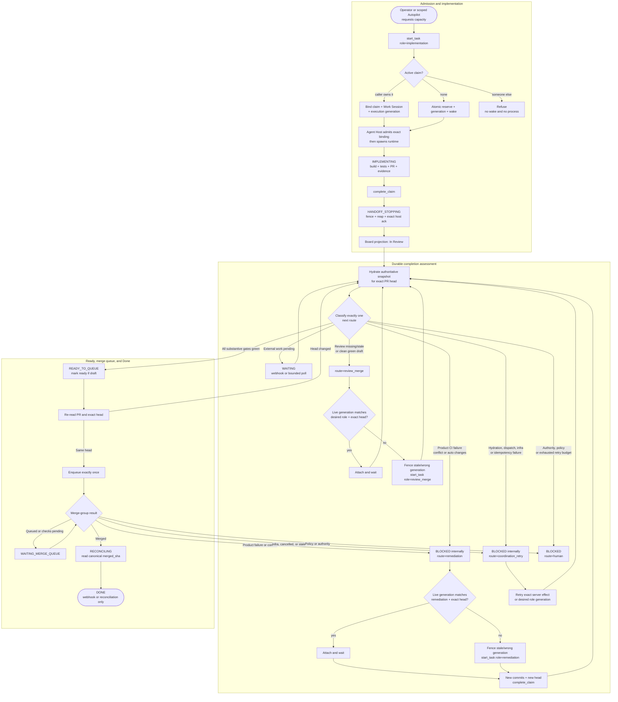

# Autopilot completion state machine

- **Status:** Final design map, approved for implementation
- **Board:** `project=switchboard`
- **Scope:** PR-backed code tasks from Start through canonical Done
- **Related:** [Completion lifecycle pipeline](COMPLETION-LIFECYCLE-PIPELINE.md),
  [Coordinator Autopilot](COORDINATOR-AUTOPILOT.md), COORD-20, Task Execution

## Decision

Switchboard will have one durable completion state machine.

GitHub PR state, CI, review verdicts, mergeability, merge queue state, board
status, claims, Work Sessions, and runner state are inputs or projections. None
of them independently decides what work to start next.

The state machine classifies one next action as a typed route:

```text
wait
review_merge
remediation
coordination_retry
human
reconcile
none
```

The coordinator selects work by `route`, never merely because the board says
`Blocked`.

No new board status is required.

## Authoritative record

There is one active completion run per task until the task reaches a terminal
state. A durable current-state record contains at least:

```text
run_id
task_id
pr_number
head_sha
state
route
reason_code
desired_role
attempt
state_version
next_retry_at
evidence_refs
created_at
updated_at
```

The existing append-only task completion transitions remain the event and
evidence history. They do not serve as the current-state authority.

A new PR head:

1. increments `state_version`;
2. updates the current exact `head_sha`;
3. invalidates CI, review, merge-gate, and queue evidence for the old head;
4. returns the run to exact-head assessment.

## Full lifecycle



## Required precedence

Completion assessment happens before attaching to an existing review or
remediation runner.

```text
hydrate exact-head snapshot
-> classify desired route and desired role
-> compare live generation with desired role and exact head
-> attach only when both match
-> otherwise fence and replace the stale or wrong generation
```

This prevents an already-running `review_merge` process from winning merely
because it matches the head when newer evidence requires remediation.

The classifier applies these decisions in order:

1. Valid terminal provenance means `none`.
2. A canonically merged PR with a non-Done task means `reconcile`.
3. A closed, unmerged PR means an authorized coordination repair or `human`.
4. A missing PR/head or mismatched board and GitHub head means
   `coordination_retry`.
5. An active merge-queue entry is assessed before starting another role.
6. Exact-head CI and review findings determine whether to wait, review,
   remediate, retry coordination, or require a human.
7. Mergeability is decomposed into its underlying cause.
8. Draft is evaluated only after substantive failures. Draft never masks red
   CI, conflicts, or requested changes.
9. Only a clean, green, exact-head snapshot advances to `READY_TO_QUEUE`.
10. Runner reconciliation happens after the desired route and role are known.

## Board projection

The completion state is authoritative. Board status is a coarse operator
projection.

| Completion state or route | Board projection | Behavior |
|---|---|---|
| Ready for first implementation | `Not Started` | Implementation may be admitted |
| Implementation running | `In Progress` | Wait for `complete_claim` |
| Handoff stopping | `In Progress` | Show `Stopping`; retain exclusive ownership |
| `wait` | `In Review` | Await webhook or bounded poll |
| `review_merge` | `In Review` | Ensure exact-head review generation |
| `coordination_retry` | `In Review` | Repair orchestration without board flicker |
| `reconcile` | `In Review` | Recover canonical merge provenance |
| `remediation`, waiting for capacity | `Blocked` | Visible failed gate with automatic route |
| Remediation admitted | `In Progress` | Fresh coding generation owns the repair |
| `human` | `Blocked` | Sticky until authority or policy is resolved |
| Valid canonical merge provenance | `Done` | Terminal |
| Cancelled task | `Cancelled` | Terminal |

`coordination_retry` is internally a blocked completion decision, but it stays
`In Review` on the board. This avoids `Blocked -> In Review` flicker for
short-lived hydration, dispatch, or idempotency repairs.

`Cancelled` is honoured as terminal by the reconciliation, replay, and
deliverable-closure paths, but it is not in the writable status enum exposed by
the task APIs (`Not Started`, `In Progress`, `In Review`, `Blocked`, `Done`). It
is readable-but-not-settable through the standard path; this projection assumes
that gap is closed or that cancellation is set by the paths that already
recognise it.

## COORD-20 transition

This design intentionally replaces COORD-20's current automatic remediation
reopen projection:

```text
Current:
In Review -> Not Started -> remediation admission

Target:
In Review -> Blocked(route=remediation) -> In Progress
```

COORD-20 may remain the remediation admission and acceptance-contract
mechanism. It is not the lifecycle authority. CI failures, conflicts, and
durable review findings all become producers of typed decisions in the same
completion run.

## GitHub PR mapping

### PR lifecycle

| GitHub state | Completion decision |
|---|---|
| `OPEN` | Continue exact-head assessment |
| `MERGED` | `reconcile` |
| `CLOSED` without merge | Authorized reopen via `coordination_retry`; otherwise `human` |

### Draft

| Draft state | Completion decision |
|---|---|
| `false` | Continue normal assessment |
| `true`, with substantive failure | Route from the substantive failure |
| `true`, with pending CI/review | `wait` or `review_merge` |
| `true`, all substantive gates green | `review_merge`, mark ready, re-read exact head |

Draft is not a failure and is never an early-return condition.

### Mergeability

| GitHub state | Completion decision |
|---|---|
| `MERGEABLE` | Continue |
| `CONFLICTING` | `remediation` |
| `UNKNOWN` | Bounded `wait`, then `coordination_retry` |

### `mergeStateStatus`

| GitHub state | Completion decision |
|---|---|
| `CLEAN` | Continue |
| `HAS_HOOKS` | Continue through required hooks |
| `DIRTY` | `remediation` |
| `BEHIND` | Merge queue owns it when available; otherwise `coordination_retry` to update the branch |
| `UNKNOWN` | Bounded `wait`, then `coordination_retry` |
| `UNSTABLE` | Decompose through exact-head CI; never route from this aggregate alone |
| `BLOCKED` | Decompose through CI, review, draft, policy, and conflict; never route directly from this aggregate |

## CI mapping

CI conclusions must include failure attribution:

```text
product
infrastructure
policy
authority
unknown
```

| Check state or conclusion | Completion decision |
|---|---|
| `REQUESTED`, `QUEUED`, `IN_PROGRESS`, `WAITING`, `PENDING`, `EXPECTED` | `wait` |
| `SUCCESS` | Pass |
| `NEUTRAL`, `SKIPPED` | Pass only when gate policy permits |
| `FAILURE`, `ERROR` with product attribution | `remediation` |
| `FAILURE`, `ERROR` with infrastructure attribution | `coordination_retry` |
| `TIMED_OUT` | Infrastructure retry first; remediation when logs prove a deterministic product hang |
| `CANCELLED`, `STALE`, `STARTUP_FAILURE` | `coordination_retry` |
| `ACTION_REQUIRED` | `human` |
| Missing, recently dispatched | `wait` |
| Missing beyond dispatch deadline | `coordination_retry` |
| GitHub evidence exists but the merge-gate payload omitted it | `coordination_retry` for hydration |

## Review mapping

| Review state | Completion decision |
|---|---|
| Exact-head durable pass or `APPROVED` | Pass |
| Missing or stale verdict | `review_merge` |
| `REVIEW_REQUIRED` | `review_merge` |
| `CHANGES_REQUESTED` with automatic findings | `remediation` |
| `CHANGES_REQUESTED` with judgment or authority findings | `human` |
| Remediation round budget exhausted | `human` |

Any new head invalidates the prior review verdict.

## Merge-gate mapping

`merge_gate` already emits coded findings. The missing component is a pure
classifier that maps those findings to one route.

| Finding class | Route |
|---|---|
| Actual test/build failure | `remediation` |
| Conflict markers, dirty implementation evidence, actual preflight failure | `remediation` |
| Automatic review finding | `remediation` |
| Missing or stale exact-head review | `review_merge` |
| Draft with all other gates green | `review_merge` |
| Missing supplied CI, Work Session, test, or preflight evidence that exists durably | `coordination_retry` |
| Missing CI dispatch or stale coordinator snapshot | `coordination_retry` |
| Wrong live role/head, wake failure, host failure, or idempotency conflict | `coordination_retry` |
| Wrong repository topology, prohibited target, or insufficient authority | `human` |
| Repeated failure beyond the configured budget | `human` |

The gate may continue returning `status=passed|blocked`. The route classifier
uses its coded findings and authoritative snapshot to determine ownership.

## Runner mapping

| Runner state | Completion decision |
|---|---|
| Starting or running with desired role and exact head | Attach and `wait` |
| Running with wrong role | Fence exact generation, then start desired role |
| Running against stale head | Fence exact generation, then start desired role at current head |
| `start_failed_retry` | `coordination_retry` |
| Wake lost, host unavailable, or idempotency conflict | `coordination_retry` |
| Stopping | Wait for exact host, generation, and fence acknowledgement |
| Terminal without required completion receipt | `coordination_retry` |

Role changes use a fresh `start_task` generation. They never depend on
post-start runner message injection.

The immutable admission contract must give the runtime:

```text
task_id
execution_role
exact head_sha
reason_code
acceptance contract or findings
generation
fence
```

## Merge queue mapping

| Queue state | Completion decision |
|---|---|
| No entry, all exact-head gates green | Enqueue exactly once |
| `QUEUED` | `wait` |
| `AWAITING_CHECKS` | `wait` |
| `MERGEABLE` | `wait` for canonical merge event |
| `LOCKED` | Bounded `wait`, then `coordination_retry` |
| `UNMERGEABLE`, product check failure | `remediation` |
| `UNMERGEABLE`, merge conflict | `remediation` |
| `UNMERGEABLE`, infrastructure failure | `coordination_retry` and requeue |
| `UNMERGEABLE`, policy or authority failure | `human` |
| Merged | `reconcile` |

Merge-queue dwell is not Done.

## Idempotency

An effect key is stable for the same completion decision and different for a
new head, route, role, or attempt:

```text
completion:
  run_id:
  state_version:
  task_id:
  pr_number:
  head_sha:
  route:
  desired_role:
  attempt
```

Lease renewal timestamps, heartbeat timestamps, `expires_at`, and other
continuously changing liveness values must not participate in the effect
payload or idempotency hash.

Same-state replay returns the prior receipt. A changed head or route creates a
new state version and a new effect key.

## Done and recovery

Only these events may produce board `Done`:

1. a canonical GitHub merge webhook with verified `merged_sha`; or
2. reconciliation that proves the canonical merge and records the same
   provenance.

An agent, review result, successful CI run, queue entry, or locally present
commit cannot mark the task Done.

A periodic recovery sweep handles:

- a merged PR whose webhook was dropped;
- an `In Review` task with no active completion run;
- an expired completion-controller lease;
- a stale runner generation;
- a lost queue transition;
- a retry whose deadline passed;
- a task whose board projection disagrees with the completion run.

## Validated examples

These examples capture the observed state on 2026-07-24. They are diagnostic
fixtures, not permanent statements about the PRs.

### PR #810, COORD-41

Observed:

- open draft;
- exact head `88624a605727fd44df98191d5b7dd99c73b75d9c`;
- mergeable, with aggregate `mergeStateStatus=BLOCKED`;
- claim gate green;
- VM and Playwright required checks red;
- exact-head review verdict passed;
- live `review_merge` generation on the exact head.

Correct decision:

```text
state=blocked
route=remediation
reason_code=required_exact_head_ci_failed
desired_role=remediation
board_status=Blocked
```

The running review generation does not match the newly classified desired role.
It must be fenced and replaced with a fresh remediation generation. No message
injection is required.

### PR #811, ADAPTER-23

Observed:

- open draft;
- exact head `ebd76cbf01603880d16e5ab84071da17885334b1`;
- clean and mergeable;
- required checks green;
- exact-head review verdict passed;
- no live runner;
- task execution `start_failed_retry`;
- prior `review_merge` generation targeted an older head
  (`b3073468e462570300ae7090ca555b5a00e13877`);
- the replacement attempt recorded `wake.failed` with
  `failure_class=runner_killed` and reason `replace review_merge generation
  with review_merge at exact head ebd76cbf...`. The old runner was killed and
  the replacement never started, leaving `running=false, starting=false`.

Correct decision:

```text
state=blocked
route=coordination_retry
reason_code=current_head_review_merge_start_failed
desired_role=review_merge
board_status=In Review
```

The coordinator starts a new `review_merge` generation at the current exact
head. That generation marks the PR ready, re-reads the exact head, and enqueues
it. A remediation coder is not appropriate.

### ADAPTER-25

ADAPTER-25 is not PR #811. At the observed time it was `In Progress`, had a
live implementation runner, had no PR, and carried a missing-preflight warning.
It remains in the implementation portion of the machine until it publishes PR
and completion evidence.

## Implementation centerpiece

This is a completion-controller build, not a small additional producer into
COORD-20.

### 1. Durable completion authority

Add one current `completion_runs` record per active task. Preserve
`task_completion` transitions as append-only history.

### 2. Shared authoritative hydrator

Build one exact-head snapshot from:

- board task and git state;
- canonical GitHub PR state;
- required exact-head status contexts;
- durable review verdict and findings;
- merge queue or merge-group state;
- Work Session, preflight, test, and diff evidence;
- claim, runner generation, role, head, and fence;
- canonical merge provenance.

The merge gate, coordinator, PR dock, and UI consume this same snapshot or its
projection.

### 3. Pure classifier

Implement a side-effect-free function:

```text
current completion run + hydrated snapshot
-> next state + route + reason + desired role + board projection
```

The same input must always produce the same decision.

### 4. Atomic transition

Persist the new completion decision, state version, route, reason, retry
metadata, evidence references, and board projection in one transaction.

### 5. Effect executor

Execute at most one idempotent effect:

- ensure or retry CI;
- start exact-head `review_merge`;
- queue COORD-20 remediation and start exact-head `remediation`;
- repair hydration or dispatch;
- mark a draft ready;
- enqueue exactly once;
- requeue an infrastructure-failed merge group;
- reconcile canonical merge provenance;
- emit one human escalation.

After the effect, rehydrate and classify again.

### 6. Admission-time role contract

Put role, exact head, reason, findings, generation, and fence into the runtime's
immutable assignment at admission. Remove lifecycle dependence on unsupported
message injection.

### 7. Recovery loop

Drive on webhooks where available and use a bounded sweeper for lost events and
expired retries.

## Invariants

1. Every decision is fenced to one exact PR head.
2. A head change invalidates old CI, review, gate, and queue evidence.
3. One classifier feeds coordinator routing and operator projections.
4. One active execution generation exists per task.
5. Only the generation matching desired role and exact head may be attached.
6. Exactly one `review_merge` generation may enqueue a given exact head.
7. Draft never masks another failure.
8. Every nonterminal state has an owner, route, wake condition, and retry
   policy.
9. Coordination failures never dispatch a remediation coder.
10. Role handoff uses fresh `start_task`, never message injection.
11. Queue dwell is waiting, not Done.
12. Only canonical merge provenance can produce Done.

## Required regression matrix

Before rollout, tests must prove:

- draft plus red CI routes to remediation;
- draft plus green CI and passed review routes to mark-ready and enqueue;
- pending CI waits without starting another generation;
- product CI failure and infrastructure CI failure take different routes;
- cancelled, stale, and startup-failed CI retry coordination;
- missing durable evidence is distinguished from an under-hydrated request;
- missing or stale review starts `review_merge`;
- automatic requested changes start remediation;
- judgment findings and exhausted rounds require a human;
- dirty/conflicting, behind, unknown, unstable, and blocked merge states are
  decomposed correctly;
- a live `review_merge` is fenced when remediation becomes higher priority;
- a stale-head runner is never attached;
- same-decision replay is idempotent;
- a new head or route produces a new effect key;
- mark-ready is followed by an exact-head re-read;
- enqueue happens exactly once;
- merge-group product and infrastructure failures route differently;
- a dropped merge webhook is recovered by reconciliation;
- Done without canonical provenance is refused;
- board projection matches the authoritative completion run;
- recovery remains hands-off across coordinator and host restarts;
- a task at `Blocked(route=remediation)` is still produced as a coordinator
  candidate and still dispatches;
- a task at `Blocked` whose PR merges with no webhook is still recovered to
  `Done` by the reconciliation sweep.

## Current implementation gaps

The primary gaps at the time of this design are:

- `task_completion` records transitions but explicitly does not schedule work;
- automatic remediation is produced by durable review findings, not general CI
  or merge failures;
- one PR dock classifier treats draft as an early return and can mask red CI;
- `merge_gate` emits useful coded findings but has no shared
  findings-to-route classifier;
- coordinator idempotency omits current PR head, route, desired role, and
  completion state version;
- Connect carries role/head lifecycle metadata but gives the runtime only a
  generic task instruction;
- no single server-side effect loop owns mark-ready, enqueue, remediation,
  retry, reconciliation, and recovery through Done.

These gaps are addressed by the completion run, shared hydrator/classifier,
route-driven coordinator, admission-time role contract, stable idempotency, and
recovery loop described above.

### Prerequisites of the COORD-20 status change

The `In Review -> Not Started` to `In Review -> Blocked(route=remediation)`
change is deliberate, but two live mechanisms are keyed on board status today
and both fail **silently** if the status moves first. They are prerequisites,
not follow-ups.

**1. Coordinator candidate selection is status-keyed.**
`mission_coordinator` builds candidate actions for exactly three statuses:
`Not Started` + ready + unclaimed, `In Progress` + unclaimed, and `In Review`.
`Blocked` produces no candidate at all. This is precisely why COORD-20 reopens
to `Not Started` with `assignee=None` — the existing test calls it "ready
unclaimed remediation work", and that is the mechanism that makes the task
visible again. `_scope_candidates` / `next_actions` must become route-keyed
before the status change lands, or deliverable-scoped remediation stops
dispatching with no error.

**2. Reconciliation eligibility excludes `Blocked`.**
`orphan_merge_discovery.ELIGIBLE_STATUSES` is
`{"Not Started", "In Progress", "In Review"}`. This is the sweep that self-heals
dropped merge webhooks. A task parked at `Blocked` whose PR then merges is never
swept, so the change would quietly narrow Done-recovery coverage for exactly the
tasks most likely to need it. Either add `Blocked` to the eligible set, or key
the sweep off open completion runs rather than board status.

Verified as **not** a blocker: `start_task` has no `Blocked` refusal. The only
status-based refusal in the admission path is `Triage`, so the
`Blocked(route=remediation) -> In Progress` transition is admissible as
designed.

### Adjacent hole, out of scope here

The exact-head review verdict is a merge-authorizing gate under invariant 6, but
nothing requires the reviewer principal to differ from the implementer. The
observed PR #810 verdict was recorded in `standard` mode by
`cli/COORD-41-...` — the implementing session reviewing its own work. That is a
separate defect from this design, but it weakens the gate this design leans on.
