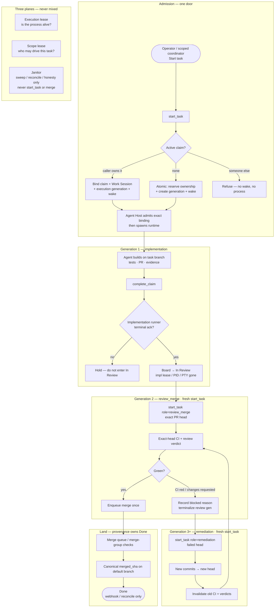

# Completion lifecycle pipeline

- **Status:** Target piping for SIMPLIFY-15 / SIMPLIFY-11
- **Board:** `project=switchboard`
- **Related:** SIMPLIFY-15 (one completion owner), SIMPLIFY-11 (delete superseded paths),
  SIMPLIFY-18 (canonical execution lease), ADR-0008, Task Execution

This is the software-engineering lifecycle Switchboard is collapsing onto: one admission
door, one durable completion run, a fresh execution generation per phase, and Done only
from canonical merge provenance.

It is **not** a new wire protocol. Agents still speak **IXP-core** / **TXP** / **OXP**.
This document is the product workflow those protocols serve.

---

## One-line summary

Start → build → hard-stop the implementer → fresh review agent → fix loop if needed →
merge queue → Done from git.

---

## Pipeline diagram

---

## Phase explainers

### 1. Admission — one door

Every runtime start goes through `start_task`. That call is the coordination-to-capacity
transaction:

- If another identity already holds an active claim → **refuse**. No wake, no runner, no
  process.
- If the caller holds the claim → reuse it and bind Work Session + generation + wake.
- If nobody holds a claim → reserve ownership and create the generation/wake **atomically**.

Agent Host then verifies the exact server-owned binding before spawn. UI, MCP, scheduler,
review, and remediation all use this same door.

### 2. Generation 1 — implementation

The implementer builds on the task branch, runs tests, opens/updates the PR, and calls
`complete_claim` with evidence.

**Hard boundary:** In Review is not observable until the implementation generation is
terminal (lease / PID / PTY / direct-session authority gone or terminal). A “stop
requested” state is not enough. This is the BUG-155 / hard-handoff rule that kills zombie
implementers sitting through review.

### 3. Generation 2 — `review_merge`

Review is a **fresh** `start_task(role=review_merge, head_sha=<exact PR head>)`. It never
attaches to, injects into, or reuses the implementation process.

That generation owns exact-head CI and the review verdict. Green → enqueue merge once.
Red CI or requested changes → record a structured blocked reason, terminalize the review
generation, and hand off to remediation.

### 4. Generation 3+ — remediation

Remediation is another fresh generation:
`start_task(role=remediation, head_sha=<failed head>)`.

New commits produce a new head. Old CI results and review verdicts for the previous head
are invalidated. Exact-head gates rerun. Same role/head is deduplicated; a different
role/head waits or fails visibly — never silently merges authorities.

### 5. Land — provenance owns Done

Only the merge queue / merge-group checks plus a canonical `merged_sha` on the default
branch may advance the board to **Done**. Agents never set Done. Webhook or reconcile
stamps provenance. Lost webhooks recover through reconcile, not a second Done writer.

---

## Three planes (do not mix)

| Plane | Question it answers | May it start work? |
|---|---|---|
| **Execution lease** | Is this process/generation alive? | No — liveness only |
| **Scope lease** | Who may drive this task/deliverable? | Yes — coordination authority for that exact target |
| **Janitor** | What bookkeeping is overdue? | **No** — sweep, reconcile, honesty findings only |

Coordinator-originated drive writes must cite an active scope id + generation. Out-of-scope,
expired, paused, or wrong-generation writes refuse with no side effects. The project-wide
daemon is a janitor, not a work owner.

---

## What this replaces

After SIMPLIFY-15 owns the phases above, SIMPLIFY-11 deletes the parallel leftovers:

- legacy `dispatch.start_task` / wake construction outside Task Execution
- multi-table “is anyone working?” presence unions
- fake/advisory runner rows synthesized from claims or presence
- claim/idle/terminal-task kill producers other than canonical lease expiry
- old `review_steward` / `merge_steward` scheduling loops
- attaching the implementation runner into review

Dogfood/canary proof (SIMPLIFY-16 and friends) is optional follow-up, not a gate on that
deletion.

---

## Protocols underneath

| Layer | Role |
|---|---|
| **IXP-core** | Presence, leases, messages, handshake |
| **TXP** | Claims, dispatch, completion evidence |
| **OXP** | Outcomes / tally / cost |

The pipeline above is Switchboard product workflow. The three profiles remain the public
wire contract agents speak.

---

## Operator mental model

Think of it as workflowed software engineering:

1. Someone starts the job (one admission).
2. A builder ships a PR and exits cleanly.
3. A reviewer/merger runs as a separate job on the exact head.
4. Failures open a fix job, then re-enter review on the new head.
5. Git landing is the only Done stamp.

Same craft. Fewer authorities. No zombie handoffs.
