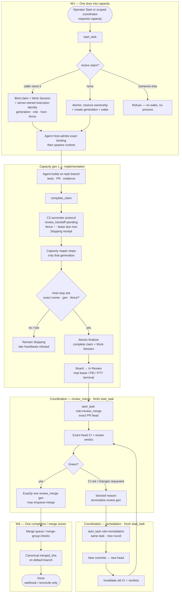

# Completion lifecycle pipeline

- **Status:** Operator-facing explainer for [ADR-0008 three-plane separation](decisions/0008-three-plane-separation.md)
- **Board:** `project=switchboard`
- **Related:** SIMPLIFY-15 (one completion owner), SIMPLIFY-18 (canonical execution lease),
  BUG-155 (hard handoff), SIMPLIFY-16 (hands-off proof), SIMPLIFY-11 (delete superseded paths),
  Task Execution

This is the software-engineering lifecycle Switchboard is collapsing onto, as decided in
ADR-0008: three independent planes, one admission door into capacity, one durable
completion run, a fresh execution generation per role, and Done only from canonical merge
provenance.

It is **not** a new wire protocol. Agents still speak **IXP-core** / **TXP** / **OXP**.
This document is the product workflow those protocols serve.

> Note: there is a separate older ADR also numbered 0008 for narration delivery. This doc
> means [`0008-three-plane-separation.md`](decisions/0008-three-plane-separation.md).

---

## One-line summary

Start → build → surrender/stop the implementer → fresh review agent → fix loop if needed →
merge queue → Done from git.

---

## Pipeline diagram

```mermaid
flowchart LR
  subgraph CAP["Plane 1 — Capacity"]
    C1["Which execution generation is alive?"]
    C2["runner_sessions = only liveness registry"]
    C3["Only lease expiry or explicit surrender<br/>may auto-stop a managed process"]
  end

  subgraph COM["Plane 2 — Communication"]
    M1["Messages / timeouts = delivery truth only"]
    M2["May audit, notify, surface findings"]
    M3["Must NOT wake, kill, remediate, or merge"]
  end

  subgraph COORD["Plane 3 — Coordination"]
    W1["Drives Start → review → remediate → Done"]
    W2["Needs fenced scope lease to write"]
    W3["Global daemon is janitor only"]
    W4["Task Execution owns completion"]
  end

  CAP -.->|"reads; never impersonates"| COORD
  COM -.->|"reports; never drives"| COORD
  COORD -->|"requests via start_task only"| CAP
```





---

## Phase explainers

### 1. Admission — one door into capacity (W1)

Every runtime start goes through `start_task`. Coordination requests capacity; it does not
construct wakes, select a process, or boot a runner directly.

- If another identity already holds an active claim → **refuse**. No wake, no runner, no
  process.
- If the caller holds the claim → reuse it and bind Work Session plus the server-owned
  execution identity (execution ID, monotonic generation, role/head, host, fence).
- If nobody holds a claim → reserve ownership and create the generation/wake **atomically**.

Agent Host then verifies that exact binding before spawn. UI, desktop MCP, scheduler,
review, remediation, and scoped coordinator starts all use this same door.

### 2. Generation 1 — implementation hard handoff (C3)

The implementer builds on the task branch, runs tests, opens/updates the PR, and calls
`complete_claim` with evidence.

`complete_claim` does **not** kill the process and does **not** immediately expose In
Review. Per ADR-0008 C3 it:

1. resolves one exact implementation execution identity;
2. preserves completion evidence on the Task Execution run;
3. marks `review_handoff=pending` while retaining exclusive task ownership;
4. increments the execution fence, revokes session authority, and makes the lease due now;
5. returns an idempotent **Stopping** receipt.

The capacity reaper then stops only that supervised generation. The owning host
acknowledges the exact runner, generation, and fence. Only that host acknowledgement plus
the canonical finalizer may complete the claim/Work Session and expose **In Review**.

Host outage, kill failure, or lost acknowledgement remains visibly Stopping. Late
heartbeats or tokens from the fenced generation are refused.

### 3. Generation 2 — `review_merge` (W4)

Review is a **fresh** `start_task(role=review_merge, head_sha=<exact PR head>)`. It never
attaches to, injects into, or reuses the implementation process.

That generation owns exact-head CI and the review verdict. Green → at most one
`review_merge` generation enqueues merge. Red CI or requested changes → first-class
`blocked(reason)`, terminalize the review generation, open a remediation round.

### 4. Generation 3+ — remediation (W4)

Remediation is another fresh generation on the **same task**:
`start_task(role=remediation, ...)`.

New commits produce a new head. Old CI results and review verdicts for the previous head
are invalidated. Exact-head gates rerun. Same role/head is deduplicated; a different
role/head waits or fails visibly — never silently merges authorities.

### 5. Land — provenance owns Done

Only merge-queue / merge-group checks plus a canonical `merged_sha` on the default branch
may advance the board to **Done**. Agents never set Done. Webhook or reconcile stamps
provenance. Outcomes are `merged(provenance)` or `blocked(reason)`.

---

## Three planes (ADR-0008)

These are independent. No row, timeout, or inference in one plane may impersonate
authority from another.

| Plane | Question | Must not |
|---|---|---|
| **1. Capacity** | Which physical execution generation is alive? | Impersonate coordination or message authority |
| **2. Communication** | Was the message stored / delivered / acked / timed out? | Wake, start, retry, fence, kill, remediate, or merge |
| **3. Coordination** | Who may drive this started task/deliverable to Done? | Construct wakes or treat scope lease as process liveness |

### Capacity notes (C1–C3)

- `runner_sessions` is the only execution-liveness registry.
- Claims, Work Sessions, messages, wakes, agent presence, and scope leases are **not**
  liveness and must not be unioned into it.
- Automatic managed-process stop happens only when the execution lease is due: heartbeat
  TTL expiry, or explicit surrender at a role boundary. Operator Kill remains an audited
  exception.

### Communication notes (M1–M3)

A message timeout may audit, notify the sender, and place an operator finding. It may not
drive lifecycle. If a recipient is offline, the receipt says stored and unreachable; a
scoped coordinator may separately request capacity through `start_task`.

### Coordination notes (W2–W3)

Drive writes require a fenced `autopilot_scopes` lease (scope id, holder, generation/fence,
exact task or deliverable target, Start provenance). Missing/expired/wrong-scope writes
fail closed with no side effects.

The global daemon is a **janitor** (sweep, reconcile provenance, regenerate briefs,
honesty findings). It is not a third plane and may not call `start_task`, instruct agents,
dispatch review/remediation, queue/merge, or control runners.

---

## Authoritative roadmap (from ADR-0008)

```text
BUG-155 → SIMPLIFY-20 → SIMPLIFY-18 → SIMPLIFY-15 → SIMPLIFY-16 → SIMPLIFY-11
```

| Step | Job |
|---|---|
| BUG-155 | Exact surrender, Stopping, host ack, atomic In Review |
| SIMPLIFY-20 | One lease clock; delete rival automatic stop paths |
| SIMPLIFY-18 | `runner_sessions` is the only liveness registry |
| SIMPLIFY-15 | Task Execution owns completion; scoped coordinator; janitor demotion |
| SIMPLIFY-16 | Hands-off four-task proof across restarts |
| SIMPLIFY-11 | Delete side doors, old stewards, compatibility paths after proof |

SIMPLIFY-21 (communication-only timeouts) runs in parallel and is a hard dependency of
SIMPLIFY-16.

---

## What SIMPLIFY-11 deletes (after proof)

- legacy wake construction outside Task Execution
- multi-table “is anyone working?” presence unions
- fake/advisory runner rows synthesized from claims or presence
- claim/idle/terminal-task kill producers other than lease due / surrender
- old `review_steward` / `merge_steward` scheduling loops
- attaching the implementation runner into review
- message-timeout wake / lifecycle recovery actions (with SIMPLIFY-21)
- stale docs/tests that describe the roaming daemon as a work owner

---

## Protocols underneath

| Layer | Role |
|---|---|
| **IXP-core** | Presence, leases, messages, handshake |
| **TXP** | Claims, dispatch, completion evidence |
| **OXP** | Outcomes / tally / cost |

The pipeline above is Switchboard product workflow. The three profiles remain the public
wire contract agents speak.

---

## Operator mental model

Think of it as workflowed software engineering under three separated authorities:

1. Someone starts the job (coordination scope + one capacity admission).
2. A builder ships a PR, surrenders the lease, and is actually stopped before review.
3. A reviewer/merger runs as a separate capacity generation on the exact head.
4. Failures open a fix generation on the same task, then re-enter review on the new head.
5. Git landing is the only Done stamp.
6. Messages never drive that machine; the janitor never owns it.

Same craft. Separated planes. No zombie handoffs.
