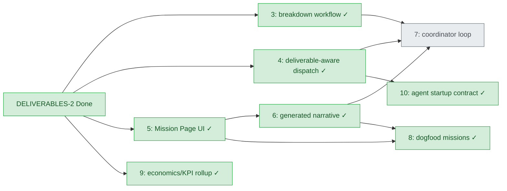

# Project Boards, Missions, And Deliverables

Switchboard now has a product-outcome layer under Projects.

The core rule is:

```text
Projects own repo/trust/policy/access/CI/model/budget/Done authority.
Boards/Missions own live outcome cockpits.
Epics/workstreams/tasks own execution.
Deliverables define what shipped value means inside a Board/Mission.
```

Tasks still live in exactly one project database and one workstream. A Board/Mission lives in one
owning Project database. A deliverable also lives in one owning Project database and may attach to
one Board/Mission, but it may link tasks from any project through explicit
`project_id + task_id` references. This lets an operator track a mission such as "Helm C++ + WebGPU
Renderer" across `helmrenderer`, `helm`, and `vulkan` without moving tasks or cross-polluting board
state.

## Data Model

`project_boards`

- `id`: stable board/mission id, such as `helm-cpp-webgpu-renderer`
- `title`
- `kind`: `board` or `mission`
- `status`: `proposed`, `active`, `paused`, `blocked`, `done`, or `archived`
- `owner_org`
- `owner_person_or_role`
- `purpose`
- `end_state`
- `description`
- `metadata_json`

`deliverables`

- `id`: stable outcome id, such as `helm-cpp-webgpu-renderer`
- `board_id`: optional owning Board/Mission id inside the same Project
- `title`
- `status`: `proposed`, `approved`, `in_progress`, `blocked`, `in_review`, `done`, or `archived`
- `owner_org`
- `owner_person_or_role`
- `end_state`: plain-English description of what exists when the mission ships
- `why_it_matters`
- `confidence`: optional `0.0` to `1.0`
- `acceptance_criteria_json`
- `policy_constraints_json`
- `proof_requirements_json`
- `kpi_links_json`
- `metadata_json`

`deliverable_milestones`

- `id`: scoped under the deliverable when generated, such as
  `helm-cpp-webgpu-renderer:build-webgpu-ingest`
- `deliverable_id`
- `title`
- `description`
- `status`: `not_started`, `in_progress`, `blocked`, `in_review`, `done`, or `skipped`
- `sort_order`
- `acceptance_criteria_json`
- `proof_requirements_json`

`deliverable_task_links`

- `deliverable_id`
- `board_id`
- `milestone_id`
- `project_id`
- `task_id`
- `role`
- `blocks_deliverable`
- `proof_required_json`
- `metadata_json`

`project_id` is always explicit. Unknown projects fail closed. Unknown `board_id` / `mission_id`
values fail closed. Linked tasks are validated by reading the target project directly; the link
operation does not mutate the target task or write into the target project database.

## Progress Semantics

Mission progress is derived from linked task state:

- `Done` counts as done only when the task has terminal provenance.
- `In Review` is reported separately.
- `Blocked` is reported separately.
- External CI mirror proof is reported separately as required/passed/blocked counts when a
  deliverable link or task gate requires `external_ci_passed`.
- Missing or unreachable linked task snapshots remain visible as errors.

This mirrors Switchboard's Done policy: green means merged/proven, not "an agent said it was done."
Public CI proof can satisfy a review/verification gate for a private source SHA, but it is not
merge provenance and does not make a task Done.

## Example: Helm C++ + WebGPU Renderer

Owning project: `helmrenderer`

End state:

```text
Helm renders chart layers in the browser from shared C++ nautical semantics, with WebGPU visible to
users and deterministic fixture parity proving the pipeline.
```

Milestones:

- Define shared render model.
- Export first deterministic fixture.
- Build WebGPU ingest.
- Integrate into Helm runtime.
- Prove parity and performance.
- Ship visible demo.

Linked tasks may come from:

- `helmrenderer`: integrated visible-renderer acceptance work
- `helm`: boat/runtime C++ policy and Helm web integration
- `vulkan`: backend-neutral renderer proof slices

## Example: Switchboard Access Rollout

Owning project: `switchboard`

End state:

```text
Multiple humans can safely access Switchboard, invite collaborators, scope agents to projects, and
provide feedback without gaining unauthorized project-creation or agent-dispatch powers.
```

Milestones:

- Auth and session protection.
- Org/user/project role model.
- Scoped MCP/API tokens.
- Project creation permissions.
- Human invites and management.
- Subscription/agent entitlement ledger.
- Feedback inbox to plan proposal flow.
- UI permissions and restricted controls.

## MCP/API Surfaces

Initial tools:

- `create_project_board`
- `get_project_board`
- `list_project_boards`
- `create_deliverable`
- `get_deliverable`
- `list_deliverables`
- `add_deliverable_milestone`
- `link_task_to_deliverable`

Initial REST routes:

- `GET /api/projects/{project}/boards`
- `POST /api/projects/{project}/boards`
- `GET /api/projects/{project}/boards/{board_id}`
- `GET /api/deliverables?project={project}&board_id={board_id}`
- `POST /api/deliverables?project={project}`
- `GET /api/deliverables/{deliverable_id}?project={project}`
- `POST /api/deliverables/{deliverable_id}/milestones?project={project}`
- `POST /api/deliverables/{deliverable_id}/task_links?project={project}`

## Breakdown Workflow (DELIVERABLES-3)

1. `submit_deliverable_outcome(project, deliverable_id, outcome, target_projects_json, ...)`
   generates a deterministic milestone/task draft grouped for review. Optional
   `PM_DELIVERABLE_BREAKDOWN_LLM=1` may refine the draft when the LLM gateway is available.
2. Humans edit the pending proposal with `update_deliverable_breakdown_proposal`, or reject/defer
   with audited reasons via `reject_deliverable_breakdown` / `defer_deliverable_breakdown`.
3. `approve_deliverable_breakdown` materializes milestones and either creates new tasks
   (`action=create`, explicit `project_id + workstream_id + title`) or links existing tasks
   (`action=link`, explicit `project_id + task_id`) — never without explicit project routing.

Task drafts in a proposal use:

- `action: create` — requires `project_id`, `workstream_id`, `title`
- `action: link` — requires `project_id`, `task_id`

## Mission Brief (DELIVERABLES-6)

`generate_mission_brief` builds a structured operator brief (`switchboard.mission_brief.v1`) from
durable mission events: linked task status/provenance, blockers, milestones, next actions, and
recent deliverable activity. The brief is not a chat transcript.

- MCP: `generate_mission_brief`, `get_mission_brief`
- REST: `POST /api/deliverables/{deliverable_id}/mission_brief?project=`
- `get_mission_status` includes `mission_brief`, `narrative_state`, and `narrative_source`
- `narrative_state` flags stale/contradictory manual or generated text (similar to `rationale_state`)
- Manual edits via `update_mission_narrative` set `narrative_source=manual`

## Dogfood Mission Fixtures (DELIVERABLES-8)

`deliverable_dogfood_fixtures.py` seeds four isolated mission proofs used by
`test_deliverables_dogfood.py` and CI:

1. **QA scratch** — `qa-scratch-cross-board` spanning `qa2scratch20260702a` and
   `qa2target20260702a`
2. **Helm renderer** — `helm-cpp-webgpu-renderer` spanning `helmrenderer`, `helm`, and `vulkan`
3. **Access rollout** — `switchboard-access-rollout` across `ACCESS`, `HARDEN`, and `QA`
   workstreams on `switchboard`
4. **Stale/blocked signals** — `stale-blocked-signals` on `qa2stale20260702a` with optimistic
   manual narrative and stale generated-brief flags

Each fixture proves `get_mission_status` / REST mission pages show cross-project links,
progress, active work, Done-with-proof, blockers, narrative, and next actions without writing
deliverable records into linked project databases.

## Workstream status



Legend: ✓ Done · ◐ In Review · plain = Not Started. Board: `switchboard` / workstream `DELIVERABLES`.

## Next Surfaces

Coordinator loops are tracked as DELIVERABLES-7. Agent startup from `deliverable_id` /
`mission_id` is documented in [`DELIVERABLE-FIRST-STARTUP.md`](DELIVERABLE-FIRST-STARTUP.md).
