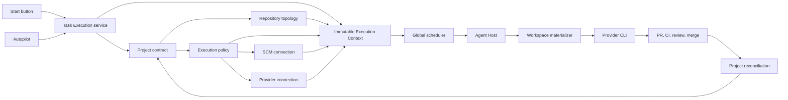

# Project-Independent Execution Plane

- Status: Proposed
- Date: 2026-07-24
- Scope: Switchboard Start, Autopilot, Agent Hosts, CLI runners, workspaces, credentials, pull requests, and completion

## Decision

Switchboard will resolve every task launch from project-owned configuration into one immutable
execution context. The Start button, MCP launcher, retry, resume, and Autopilot will all use the
same `start_task` operation.

A newly created project must be able to run on persistent or ephemeral CLI capacity without:

- application code changes;
- project-specific service units;
- project-specific environment variables;
- pre-cloned repositories;
- global GitHub tokens;
- repository or branch defaults inherited from Switchboard itself.

The execution plane will treat project metadata as the authority for repository identity,
runtime policy, provider authorization, SCM authorization, placement, workspace creation, and
completion provenance.

## Problem

Switchboard is multi-project in its project registry, UI, API, task state, and repository
topology. The execution substrate remains effectively single-project and single-repository:

- Connect preserves the project but carries only the symbolic workspace value
  `repo:canonical`.
- Agent Host launches the CLI in its configured `repo_root`.
- Host repository capabilities default to `6th-Element-Labs/projectplanner`.
- Managed Work Sessions require a pre-existing local source checkout.
- Cloud fleet bootstrap downloads and advertises the projectplanner mirror.
- Provider credentials support project allowlists, but Connect does not consistently bind one
  into placement.
- GitHub access normally comes from global `GH_TOKEN` or `GITHUB_TOKEN`.
- The deployed Autopilot configuration lists only Switchboard.

This means a task can be correctly identified as belonging to Atlas while still having no safe,
project-derived route to an ActionEngine workspace, provider identity, or repository credential.

Adding an Atlas-specific host service or another `PM_REPO_PATH_ATLAS` variable would move the
hard-coding rather than remove it.

## Design principles

1. Project configuration is data, not application branching.
2. `start_task` is the only public execution launch operation.
3. The server resolves execution authority before dispatch.
4. Wakes contain references and immutable facts, never raw credentials.
5. Runner software is independent of the repository being modified.
6. Every task runs in an isolated, execution-specific workspace.
7. Provider credentials and repository credentials are separate trust boundaries.
8. Placement always fails closed on project, runtime, trust, credential, and workspace
   incompatibility.
9. Pull request, merge, and Done provenance remain bound to the original execution.
10. A future project requires configuration and readiness proof, not deployment.

## System map



## One launch path

All execution surfaces call:

```text
start_task(project, task_id, runtime, role)
```

The caller supplies intent only:

- project;
- task;
- runtime;
- execution role.

The caller does not choose:

- a host;
- a repository path;
- a checkout;
- a branch;
- a provider credential;
- a repository credential;
- a fleet image.

The existing operator launcher can improve discovery of `start_task`, but it does not create a
second execution path and is not responsible for claims, workspaces, credentials, or placement.

## Project-owned contracts

Each project has three distinct contracts.

### Repository topology

Repository topology remains the authority for code truth, verification routes, publication, and
Done:

```json
{
  "schema": "switchboard.project_repo_topology.v1",
  "roles": {
    "canonical": {
      "provider": "github",
      "repo": "6th-Element-Labs/ActionEngine",
      "default_branch": "main"
    },
    "public_ci": {},
    "public": {},
    "release": {}
  }
}
```

The canonical role supplies the repository and default branch for implementation. Other roles
remain evidence or publication routes and must not become code-truth substitutes.

### Project execution policy

Add a project-owned execution policy:

```json
{
  "schema": "switchboard.project_execution_policy.v1",
  "enabled": true,
  "autopilot_enabled": true,
  "allowed_runtimes": ["codex", "claude-code"],
  "workspace": {
    "repo_role": "canonical",
    "isolation": "task_workspace",
    "materialization": "remote_clone_or_cache"
  },
  "placement": {
    "allowed_host_classes": ["persistent", "ephemeral"],
    "allowed_trust_zones": ["company"],
    "burst_enabled": true
  },
  "provider_selectors": {
    "codex": ["connection/openai-primary"],
    "claude-code": ["connection/anthropic-primary"]
  },
  "scm_connection_ref": "scm/github-6el"
}
```

The policy stores references and constraints. It never stores a raw credential.

### SCM connection

Repository authorization becomes first-class and separate from AI provider authorization:

```json
{
  "schema": "switchboard.scm_connection.v1",
  "connection_ref": "scm/github-6el",
  "provider": "github",
  "auth_type": "github_app",
  "installation_ref": "opaque-reference",
  "organization": "6th-Element-Labs",
  "project_allowlist": ["atlas", "switchboard"],
  "repository_allowlist": [
    "6th-Element-Labs/ActionEngine",
    "6th-Element-Labs/projectplanner"
  ]
}
```

The initial implementation can use GitHub App installations. The contract should retain an SCM
provider field so another repository provider does not require redesigning execution.

At execution time, Switchboard obtains a short-lived token scoped to the selected repository and
operation. Global GitHub environment tokens are not the normal runner authorization path.

## Immutable Execution Context

Before creating a wake, `start_task` resolves project configuration into an immutable,
server-owned snapshot:

```json
{
  "schema": "switchboard.execution_context.v1",
  "execution_id": "exec-...",
  "generation": 1,
  "project": "atlas",
  "task_id": "IDENTITY-2",
  "runtime": "codex",
  "repository": {
    "role": "canonical",
    "provider": "github",
    "slug": "6th-Element-Labs/ActionEngine",
    "default_branch": "main",
    "base_sha": "exact-origin-main-sha"
  },
  "workspace": {
    "isolation": "task_workspace",
    "branch": "codex/atlas-identity-2",
    "materialization": "remote_clone_or_cache"
  },
  "provider_connection_ref": "connection/openai-primary",
  "scm_connection_ref": "scm/github-6el",
  "project_contract_version": 14,
  "context_digest": "sha256:..."
}
```

The execution context is the common input to:

- placement;
- workspace creation;
- CLI launch;
- provider leasing;
- Git fetch and push;
- pull request creation;
- CI policy;
- review and merge;
- reconciliation.

No downstream component falls back to `PM_PROJECT`, `PM_REPO_ROOT`, `master`, the current working
directory, or projectplanner defaults.

The context stores no secrets. Credential references are materialized only after a host has
claimed the exact wake.

If project topology or execution policy changes before process launch, the old context is fenced
and a new execution generation must be resolved. Once launched, the execution remains bound to
its exact repository and base SHA.

## Global execution registry

Agent Host inventory and capacity belong in an organization-level execution registry rather than
being duplicated separately inside each project database.

The registry contains:

- host identity and owner;
- organization and trust zone;
- persistent or ephemeral host class;
- supported runtimes;
- supported provider materialization modes;
- supported SCM providers;
- workspace backends and isolation modes;
- capacity, health, version, and drain state;
- project allowlists.

Example:

```json
{
  "schema": "switchboard.agent_host_capabilities.v2",
  "host_id": "host/steve-mbp",
  "organization": "org-6th-element-labs",
  "projects": ["atlas", "switchboard", "helm"],
  "runtimes": ["codex", "claude-code"],
  "scm_providers": ["github"],
  "workspace_backends": ["git-cache", "isolated-clone"],
  "isolation_modes": ["task_workspace"],
  "max_sessions": 8
}
```

A generic host does not require a target repository to be preinstalled. Repository access is
proven through the SCM connection and workspace materializer. An air-gapped or local-only host
may additionally advertise an explicit repository allowlist.

Project task data can remain physically isolated. Shared host capacity, placement reservations,
and provisioning state live in the execution control plane.

## Mandatory hybrid placement

Every Connect wake uses hybrid placement. The legacy placement path is removed after migration.

Placement evaluates:

1. project allowed on host;
2. runtime supported;
3. trust zone allowed;
4. workspace backend available;
5. SCM provider supported;
6. provider connection compatible;
7. provider credential capacity available;
8. SCM authorization valid for the repository;
9. physical runner capacity available;
10. ephemeral provisioning allowed;
11. execution context version still valid.

Placement is checked when the wake is created and again when a host claims it. A host cannot gain
eligibility merely because it sees a wake.

Failed requests return typed results:

```text
project_execution_disabled
repo_topology_invalid
scm_connection_missing
repository_not_authorized
provider_connection_missing
provider_not_allowed
no_eligible_host
runtime_not_supported
ephemeral_capacity_unavailable
execution_context_stale
```

There is no indefinite hidden queue. A request either fails with an actionable reason, waits
under an explicit bounded deadline, or provisions permitted ephemeral capacity.

## Generic workspace materializer

Runner software and task repositories have separate homes:

```text
/opt/switchboard-agent-host/                 runner software
/var/lib/switchboard/repo-cache/github/...   bare repository caches
/var/lib/switchboard/workspaces/
    atlas/IDENTITY-2/exec-123/               ActionEngine checkout
    switchboard/BUG-155/exec-456/            projectplanner checkout
```

For every execution, the host:

1. receives and verifies the execution context;
2. acquires a short-lived SCM lease;
3. creates or refreshes a repository cache;
4. verifies that `origin` equals the context repository;
5. fetches the exact base SHA;
6. creates a fresh isolated checkout;
7. verifies HEAD and declared default-branch ancestry;
8. creates the task branch;
9. launches the provider CLI with the isolated workspace as `cwd`;
10. records workspace and repository receipts;
11. issues a new narrowly scoped SCM lease when push or PR access is needed;
12. cleans or quarantines the workspace after completion.

The materializer must succeed when the host has never seen the repository before. Project-specific
source-path environment variables are not required.

Repository caches are performance aids, not authority. A stale or poisoned cache is rejected when
remote identity or object verification fails.

## Generic cloud fleet

The fleet image contains:

- Agent Host runtime;
- Git and supported SCM clients;
- provider CLIs;
- workspace materializer;
- secure credential client;
- monitoring and cleanup.

It does not contain projectplanner as the task repository or operating checkout.

Repository cache objects are keyed by:

```text
SCM provider + repository slug + object SHA
```

Atlas and Switchboard wakes provision the same generic image. Their immutable execution contexts
select different repositories and credentials.

## Credential boundaries

Execution uses three distinct identities:

| Identity | Purpose |
|---|---|
| Control-plane token | Claim wake, heartbeat, activity, and task operations |
| Provider connection | Authenticate Codex, Claude, or Cursor |
| SCM connection | Clone, fetch, push, create PR, inspect checks, and merge |

They are not interchangeable.

Every credential lease binds exactly:

```text
organization
project
task
execution generation
host
runner session
provider or repository
allowed operations
expiration
```

Revocation prevents new launches immediately and fences active leases according to the
connection policy. Raw credentials never appear in wake payloads, project metadata, task
activity, runner receipts, or logs.

## Completion provenance

When a worker creates a pull request, Switchboard persists:

```text
project
task
execution_id
repository
branch
pull request number
head SHA
base branch
SCM connection reference
```

CI, review, merge, webhook intake, and reconciliation use this persisted binding.

The system does not infer a project solely by reverse-searching which project currently names a
repository. This is required for monorepos and for multiple projects that intentionally share a
canonical repository.

Only the repository and base branch recorded in the execution context can satisfy code Done.

## Project readiness

Add a single readiness query used by settings, Start, and Autopilot:

```json
{
  "schema": "switchboard.project_execution_readiness.v1",
  "project": "atlas",
  "configuration": {"ready": true},
  "persistent_runner": {"ready": true, "eligible_hosts": 1},
  "ephemeral_runner": {"ready": true},
  "autopilot": {"ready": true},
  "blockers": []
}
```

The operator sees four independent states:

- configuration ready;
- persistent runner ready;
- ephemeral runner ready;
- Autopilot ready.

The Start operation reruns the authoritative checks. The UI readiness view is explanatory, not an
authorization bypass.

## Future project onboarding

Creating a runnable project becomes:

1. create the project;
2. declare repository topology;
3. attach an SCM connection;
4. attach one or more provider connections;
5. select an execution policy;
6. run readiness validation;
7. enable manual Start;
8. enable Autopilot if desired.

Onboarding a future project requires no application deployment, service restart, environment
variable, code branch, or repository preload.

## Autopilot

Autopilot does not use a static service-level project list.

The global coordinator discovers active projects whose execution policy has
`autopilot_enabled=true`. It obtains a project-scoped coordinator lease before acting and calls
the same `start_task` operation as the UI.

Scheduling must preserve:

- project isolation;
- project and organization budgets;
- fair sharing across projects;
- dependency and readiness gates;
- task identity;
- independent review and completion authority.

Autopilot cannot bypass a failed execution readiness gate.

## Delivery plan

| Order | Work package | Depends on |
|---:|---|---|
| 1 | Project execution policy and SCM connection registry | Existing project registry |
| 2 | Immutable Execution Context resolver | 1 |
| 3 | Execution readiness API and UI | 1, 2 |
| 4 | Connect mandatory hybrid placement | 2 |
| 5 | Generic host workspace materializer | 2 |
| 6 | SCM credential broker and short-lived leases | 1, 5 |
| 7 | Launch provider CLI from resolved workspace | 4, 5, 6 |
| 8 | Project-derived PR, CI, merge, and reconciliation | 2, 6 |
| 9 | Generic multi-repository cloud fleet | 4, 5, 6 |
| 10 | Dynamic Autopilot project discovery | 3, 4, 7 |
| 11 | Atlas end-to-end proof | 1 through 10 |
| 12 | Legacy-default removal and cross-project proof | 11 |

Work packages 5 and 6 may proceed in parallel after their shared contracts are stable. Atlas is
the first non-Switchboard acceptance project, not a special implementation branch.

## Migration

### Phase 1: contracts and visibility

- Add execution policy, SCM connections, Execution Context, and readiness.
- Resolve contexts in shadow mode for current launches.
- Compare the resolved repository, branch, provider, and host against actual behavior.
- Do not change execution behavior yet.

### Phase 2: persistent host cutover

- Implement the generic workspace materializer.
- Require hybrid placement for opted-in projects.
- Launch Atlas and Switchboard tasks from resolved workspaces.
- Persist repository and credential receipts.

### Phase 3: completion cutover

- Make push, PR, CI, review, merge, and reconciliation consume Execution Context provenance.
- Remove current-working-directory and global-default inference from these paths.

### Phase 4: fleet cutover

- Replace the projectplanner fleet mirror with generic repository caches.
- Provision ephemeral workers from Execution Context.
- Prove persistent and ephemeral execution for Atlas and Switchboard.

### Phase 5: Autopilot cutover

- Replace the static project list with execution-policy discovery.
- Gate every Autopilot start on readiness.
- Prove fair, isolated concurrent work across projects.

### Phase 6: remove legacy behavior

- Delete legacy placement for task execution.
- Delete projectplanner repository defaults.
- Delete global GitHub token fallback from runner execution.
- Delete managed-workspace fallback to the application checkout.
- Delete static fleet repository assumptions.
- Reject any launch that lacks a valid Execution Context.

## Acceptance proof

The final system creates a new project and repository unknown to Switchboard at test start, then
proves:

```text
create project
-> attach repository and credentials
-> readiness green
-> click Start
-> correct host selected
-> correct repository materialized
-> CLI launched in isolated workspace
-> branch pushed to correct repository
-> PR targets declared default branch
-> CI and independent review complete
-> merge lands in canonical repository
-> task reconciles Done
-> workspace and leases cleaned
```

Run this concurrently for Atlas and Switchboard and prove:

- no shared workspace;
- no credential leakage;
- no cross-project task reads or writes;
- no wrong-repository pushes;
- no `master` versus `main` confusion;
- no projectplanner fallback;
- no raw secrets in wakes or logs;
- no per-project application code or service unit;
- restart and retry preserve the original execution binding;
- credential revocation fences subsequent operations;
- a host that is valid for one project cannot claim an unauthorized project's wake;
- persistent and ephemeral workers produce equivalent provenance.

## Explicitly rejected approaches

The following do not satisfy this design:

- one Agent Host service per project;
- `if project == "atlas"` or equivalent adapter branches;
- `PM_REPO_PATH_<PROJECT>` as the repository authority;
- requiring every host to pre-clone every repository;
- treating the host's current checkout as the task workspace;
- adding all repositories to one global GitHub token;
- copying provider credentials into wake payloads;
- allowing legacy placement when project or repository facts are missing;
- using different launch paths for the UI and Autopilot;
- calling work complete when only the implementation process exited successfully.

## Definition of done

This design is complete only when a newly configured project can pass the full acceptance proof
without code changes or infrastructure redeployment, and the legacy projectplanner-specific
execution defaults have been removed rather than retained as silent fallbacks.
