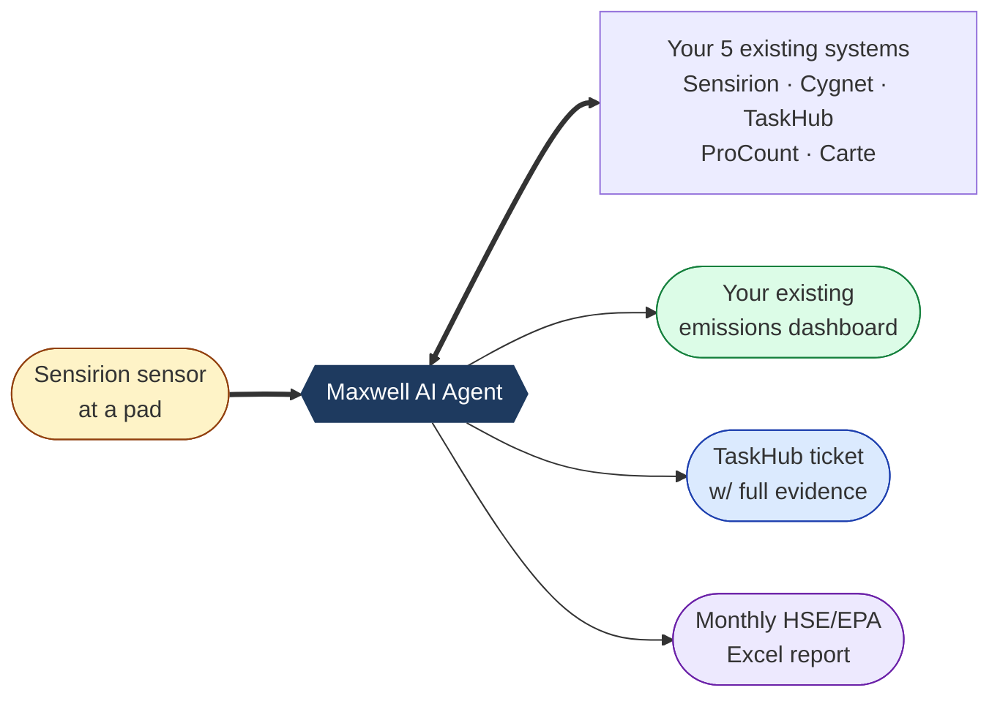
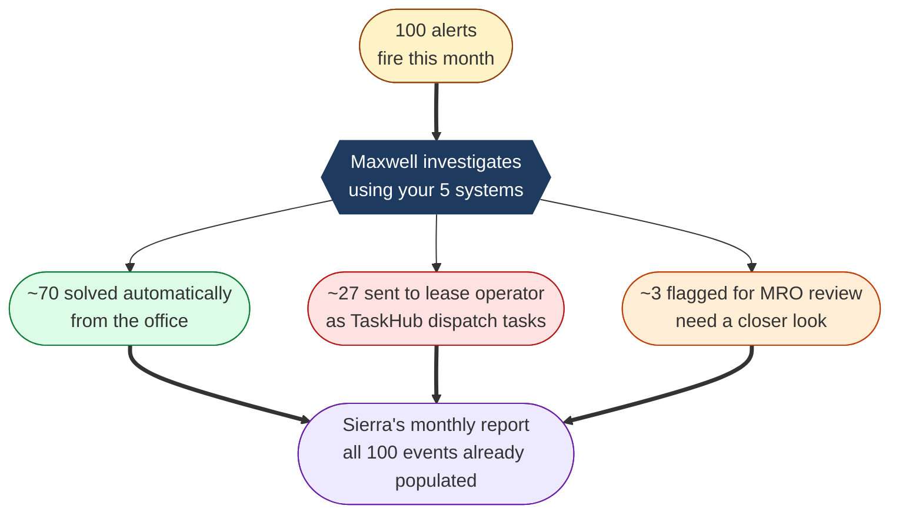
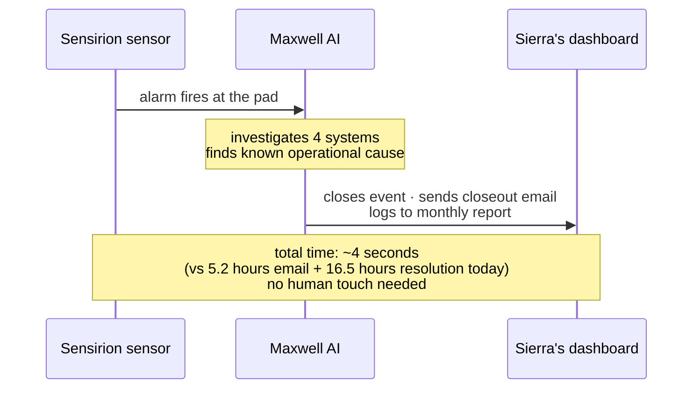
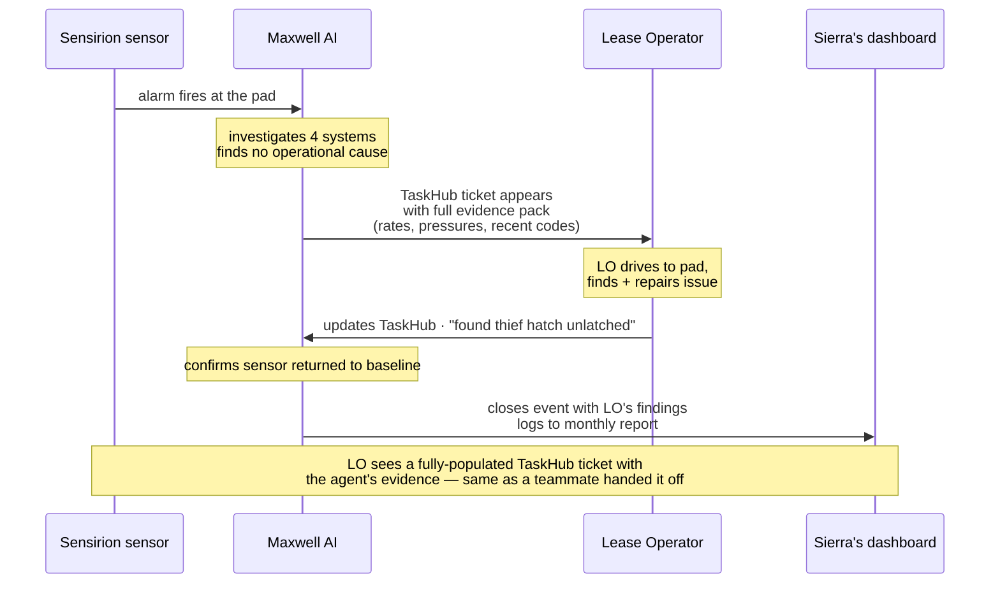
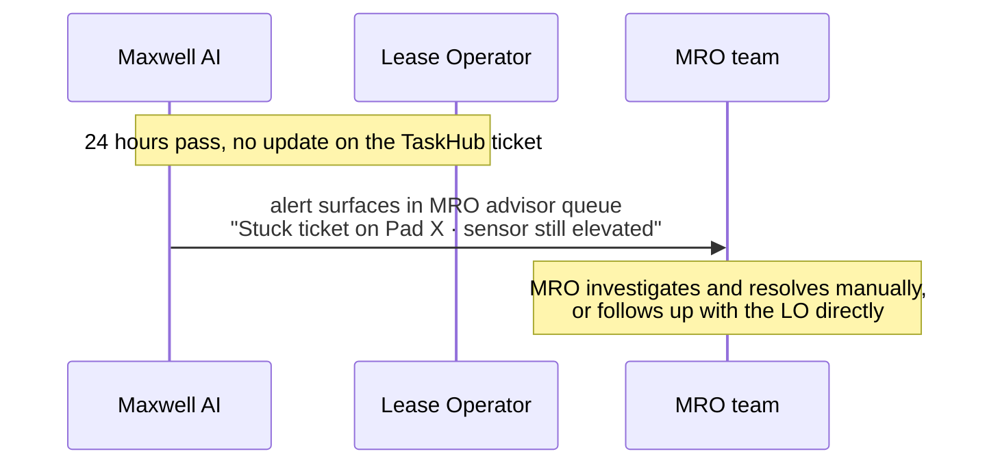

# Maxwell — Gas Release Triage Agent · Executive Summary

**For:** TEEP Barnett · Clovis, Devin, Michelle, Sierra, Mike, Darko
**From:** Taikun
**Date:** 2026-05-18
**One-line:** Maxwell does the triage work your MRO team does today — automatically, end-to-end — and prepares Sierra's monthly HSE/EPA report as a by-product.

---

## Why this matters

| Today (from your real data) | With Maxwell |
|---|---|
| 5.2-hour median delay from sensor to first email | < 10 min to first acknowledged + classified |
| MRO opens 5 systems to triage one alert | Maxwell does the cross-system work in ~4 seconds |
| Sierra hand-types ~230 events/month into Excel | Monthly report is a one-click export — already populated |
| 0% auto-closed | ~40% auto-closed in Phase 1; ~65% in Phase 2 |
| Field events: no consistent close-loop | TaskHub ticket with full evidence pack; agent closes when LO confirms |

---

## What Maxwell does end-to-end

### 1. Sits behind your existing systems (no rip-and-replace)

You keep using TaskHub, Cygnet, your monthly HSE/EPA report — same tools, same formats. Maxwell does the cross-system work behind the scenes.

---

### 2. The triage outcome — what your team experiences

MRO shifts from *"open 5 systems per alert to figure it out"* to *"approve TaskHub dispatch tickets that already have all the evidence attached."* Sierra's monthly report becomes a one-click export.

---

### 3. Office-cleared event (70% of alerts) — ~4 seconds, no human touch

Sierra sees the event already populated with `Resolution Type`, `Equipment`, `How Cleared`, and a closeout email already sent. No one had to read a Sensirion email, open 4 systems, or type anything into Excel.

---

### 4. Field-cleared event (27% of alerts) — Maxwell hands off to the LO with full context

LO opens TaskHub like any other day, except the ticket already has Maxwell's full investigation (rates, pressures, ProCount codes, similar past events) attached — no guesswork on where the leak might be. When the LO closes the field work, Sierra's monthly report updates itself.

---

### 5. Nothing stuck — guaranteed escalation

If the field side stalls, the office side sees it within a guaranteed window. Nothing gets silently dropped.

---

## What we need from TEEP

| | |
|---|---|
| **5 systems** | Read access to Sensirion (webhook), Cygnet, ProCount, Carte, TaskHub. Plus **bounded write** on TaskHub only (create/update/close dispatch tickets) + webhook in for task-updated events. No writes to the other four. |
| **Auth** | OAuth2 client credentials, behind your existing gateway. No static creds, no shared accounts, no VPN. |
| **Bootstrap path** | While the production gateway is built, S3 JSON drops in the same shape unblock dev. Sierra's xlsx already serves as the Sensirion bootstrap. |
| **Data we need from Sierra Day 1** | Confirmed — her xlsx maps 1:1 to our existing `emissions.alerts` schema. |
| **Phase 1 target** | 6–8 weeks from API availability. |

---

## Open items for the next call

1. **Confirm 5 systems are the full set.** WellView was raised on the call but not used in any of the 168 real `how_cleared` notes — dropped. Anything else you reach for that didn't come up?
2. **TaskHub write surface** — 3 endpoints (POST create, PATCH update, PATCH close) + 1 inbound webhook. Bootstrap fallback: email MRO if write isn't ready by week 4.
3. **ProCount + Carte ownership** — these are IFS Merrick products. Who's the right contact on your side?
4. **Cygnet poll cadence** — Michelle to confirm with Nubo / Weatherford.
5. **6–12 months of historical alerts** — to firm up KPI commitments and train classification beyond the current 22-day Jan sample.

---

## Where the supporting docs are

| File | What it is |
|---|---|
| [01-narrative.md](01-narrative.md) | Plain-English deep dive |
| [02-prd.md](02-prd.md) | Phase 1 PRD — goals, FRs, KPIs, system dependencies, API access ask |
| [03-architecture.md](03-architecture.md) | System architecture · mermaid diagrams · tool inventory · classifier pseudocode |
| [04-system-integrations.md](04-system-integrations.md) | Per-system REST API specs (Cygnet, ProCount, Carte, TaskHub, Sensirion) |
| [05-security-answers.md](05-security-answers.md) | Direct answers to Darko's 2026-05-14 email |
| [06-email-reply.md](06-email-reply.md) | Draft email reply (do not send — pending Steve's review) |
| [sierra-xlsx-analysis.md](sierra-xlsx-analysis.md) | Column-by-column mapping of Sierra's HSE/EPA template to our schema |
| [screens/](screens/) | 4 UI mockup PNGs (Reporting Overview · Maxwell Advisor · Triage Detail · Integration Health) |
