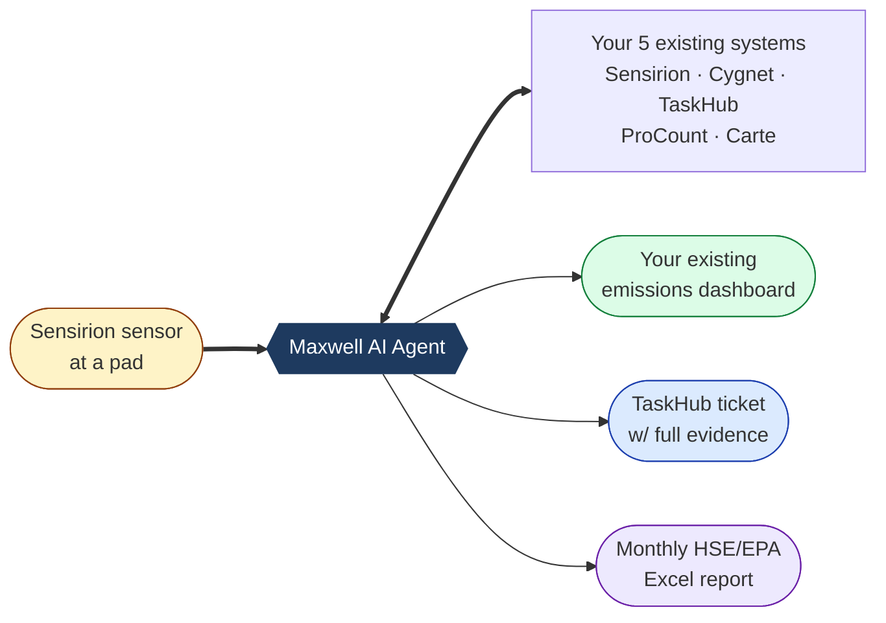
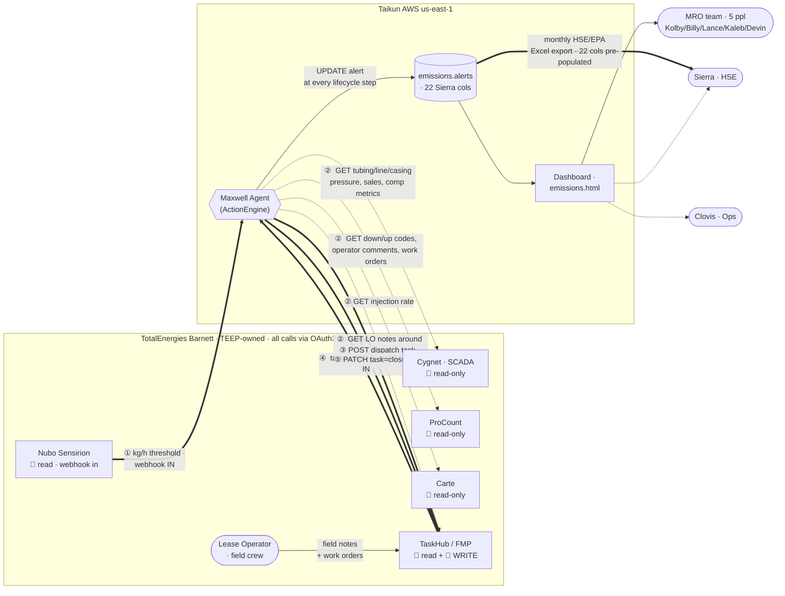
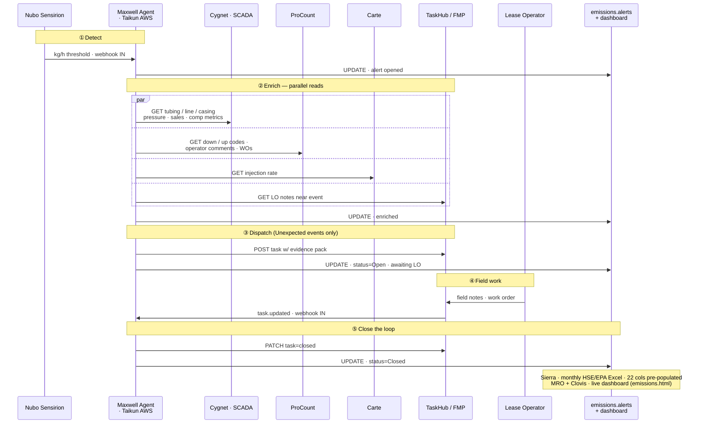
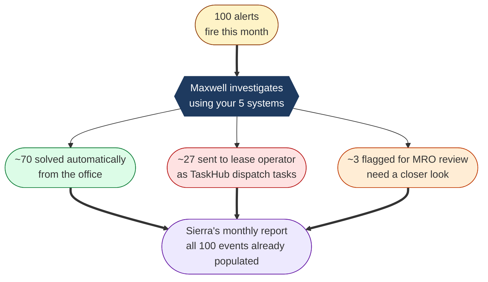
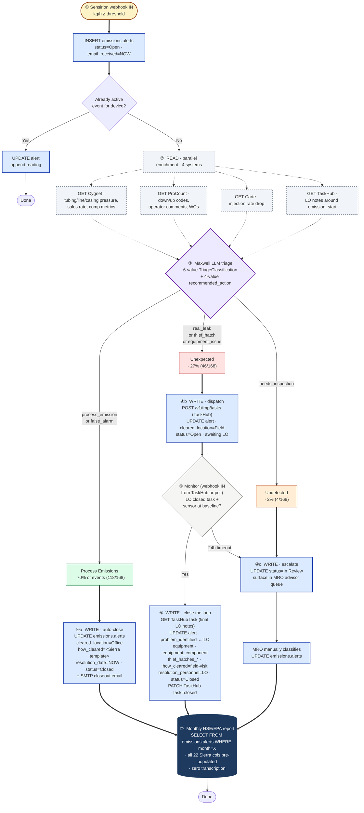
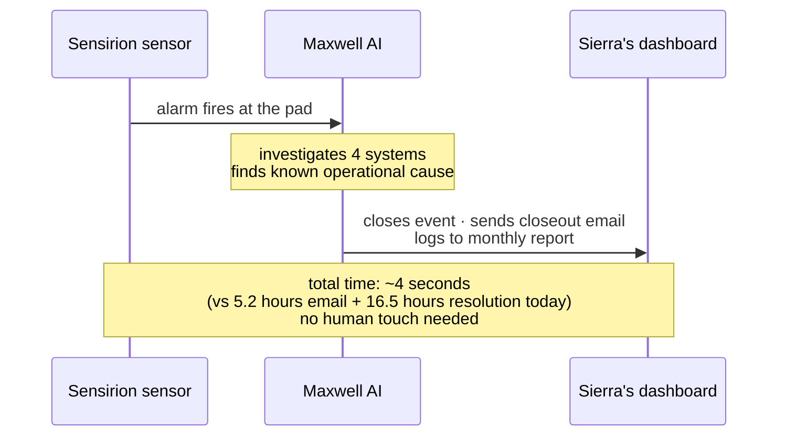
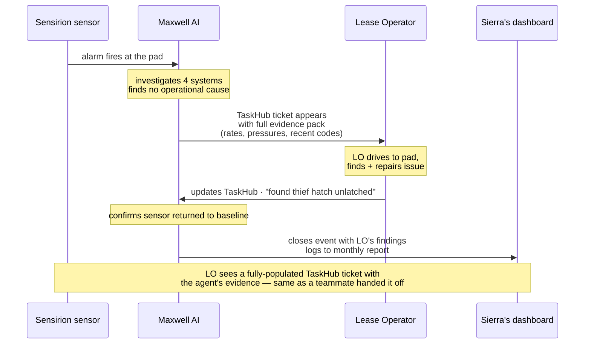
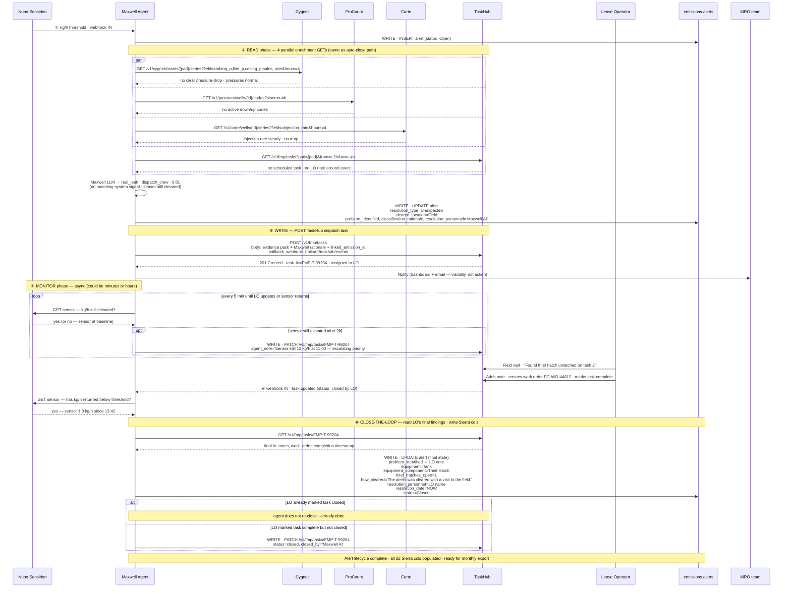
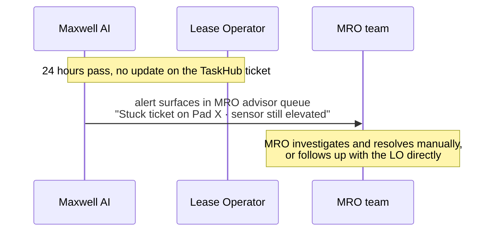
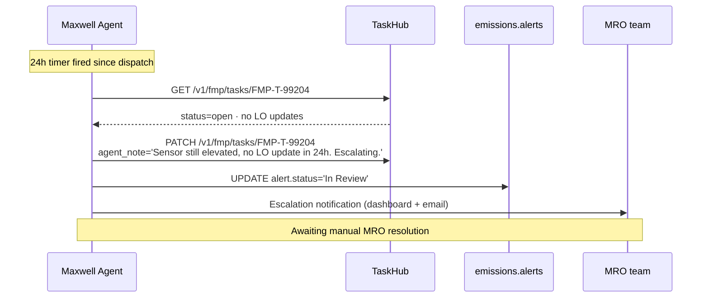

# Architecture — TEEP Barnett Gas Release Triage Agent

**Audience:** Hybrid — internal Taikun and TEEP engineering (Darko, Michelle, Mike)
**Date:** 2026-05-18

> **System list updated 2026-05-18 from real `how_cleared` notes + Sierra's xlsx.** WellView is **not** used in emissions triage (0 mentions across 168 alerts and 0 in Sierra's export). The actual stack is **5 systems**: Sensirion, Cygnet, TaskHub, ProCount, Carte.
>
> | System | Mentions in 168 notes | Role in triage | Read | Write |
> |---|---|---|---|---|
> | Sensirion | 168 (origin) | Event source | webhook in | acknowledge alert (optional) |
> | Cygnet | 95 | Pressure-drop confirmation | ✓ | — |
> | TaskHub | 93 | LO notes + work orders | ✓ | **Create dispatch task · update notes · close task** |
> | ProCount | 56 | Down/up codes, operator comments | ✓ | — |
> | Carte | 22 | Injection-rate drop confirmation | ✓ | — |
> | ~~WellView~~ | 0 | Not used | — | — |
>
> **Maxwell** is our name for the AI triage *concept*. The existing `/advisor/triage/{alert_id}` endpoint on `main` is a read-only recommendation engine using LLM context-injection over `emissions.*` data. For TEEP production, Maxwell becomes a **close-the-loop agent** — it investigates via the 5 APIs, decides, **then acts** (writes findings, opens/closes TaskHub tickets), monitors, and prepares the end-of-month report. The platform already has this close-the-loop pattern in other workflows — e.g. `tank_overflow_protection_with_servicenow.json`, `ring_energy_ai_traffic_cop_v3.json` (with human-interlock-and-timeout handling). We apply that pattern to emissions.

---

## 0. The close-the-loop concept

Today's Maxwell on `main` only *recommends* — read-only. For TEEP production, Maxwell **does the work**: investigates via the 5 APIs, decides what's happening, then acts on that decision via API. Per alert lifecycle:

| Phase | What Maxwell does | What it writes / where |
|---|---|---|
| **1. Detect** | Receive Sensirion webhook (skip the 5.2-hr email delay) | `INSERT emissions.alerts` (pad, route, emission_id, kg/h, emission_start, `status=Open`, email_received=NOW) |
| **2. Investigate** | Parallel API calls — Cygnet pressures, ProCount codes & comments, Carte injection rate, TaskHub LO notes & work orders | `INSERT emissions.event_audit` row per call (system, endpoint, response hash, latency) |
| **3. Reason** | LLM context-injection over collected evidence + pad history + similar incidents (the existing Maxwell prompt pattern, extended) | `UPDATE emissions.alerts` (problem_identified, classification_rationale JSONB, resolution_personnel=`Maxwell AI`) |
| **4. Decide** | Map LLM `TriageClassification` + `recommended_action` to one of three paths: **auto-close** / **dispatch** / **escalate** | `UPDATE emissions.alerts` (provisional cleared_location, equipment, equipment_component, resolution_type) |
| **5a. Auto-close** (confident `process_emission`) | Write final resolution fields; send Sierra's standard closeout email | `UPDATE emissions.alerts` (how_cleared = standardized template matching real Jan-2026 text, resolution_date=NOW, `status=Closed`, resolution=`sent email to close out alert`) |
| **5b. Dispatch** (`real_leak` / `thief_hatch` / `equipment_issue`) | **POST** TaskHub task with full evidence pack — *"Pad X · 148 kg/h · likely 3rd-stage scrubber dump valve · please investigate"* | Create TaskHub task via API + `UPDATE emissions.alerts` (cleared_location=`Field`, `status=Open` awaiting field) |
| **5c. Escalate** (`needs_inspection`) | Surface in MRO queue with full evidence trace | `UPDATE emissions.alerts.status=In Review` |
| **6. Monitor** (dispatch path) | Subscribe to TaskHub task-updated webhook OR poll TaskHub every 5 min; also poll Sensirion sensor for return to baseline | (read-only during this phase) |
| **7. Close-out** (LO marks TaskHub task done + sensor returns to baseline **OR** 24-hour timeout) | Read final LO notes from TaskHub; map findings to Sierra's columns; **PATCH** TaskHub task to closed | `UPDATE emissions.alerts` (problem_identified ← LO note, equipment ← LO finding, equipment_component, thief_hatches_open/_repaired/_replaced, how_cleared=`The alerts was cleared with a visit to the field.`, resolution_date=NOW, resolution_personnel=LO name, `status=Closed`) |
| **8. Monthly report** | (no action) | Sierra's HSE/EPA export = `SELECT FROM emissions.alerts WHERE month = X` — all 22 columns already populated by steps 1–7 |

**The point:** by the time Sierra runs her monthly report, every column is already populated by the work Maxwell did in real time. Zero transcription. Zero email forwarding.

### 0.1 Mapping Maxwell's enum → Sierra's `resolution_type`

Maxwell's existing 6-value `TriageClassification` (from `actionengine/engine/api/emissions_api.py` on `main`) maps to Sierra's 3-value `resolution_type` enum:

| Maxwell `TriageClassification` | Sierra `resolution_type` | `recommended_action` | Path |
|---|---|---|---|
| `process_emission` | `Process Emissions` | `office_resolve` | Auto-close with Cygnet/TaskHub how_cleared template |
| `real_leak` | `Unexpected` | `dispatch_crew` | Open TaskHub task, `cleared_location=Field`, wait for LO |
| `thief_hatch` | `Unexpected` | `dispatch_crew` | Same; auto-populate `equipment=Tank`, `equipment_component=Thief Hatch` |
| `equipment_issue` | `Unexpected` | `dispatch_crew` | Same; auto-populate `equipment_component` (Dump Valve Controller, PRV, etc.) |
| `false_alarm` | `Process Emissions` | `monitor` | Auto-close with `equipment=Process Emissions` (Sierra's brief-vent catch-all) |
| `needs_inspection` | `Undetected` | `investigate` | Escalate; await MRO review |

Sierra's monthly report continues to use her existing 3-value enum (drop-in compatible). The 6-value Maxwell taxonomy is internal — it gives the agent finer-grained reasoning + action selection.

### 0.2 Workflow shape (JSON-style, ActionEngine pattern)

The close-the-loop flow is structurally identical to the platform's existing `tank_overflow_protection_with_servicenow` workflow, applied to emissions:

```jsonc
{
  "workflow_id": "emissions_triage_close_loop",
  "name": "Maxwell — Emissions Close-the-Loop Triage",
  "trigger": { "type": "webhook", "source": "teep_gateway", "event": "sensirion.kg_per_hr_threshold_crossed" },
  "steps": [
    { "id": "open_alert",       "tool": "emissions.alerts.insert",
      "writes": ["status='Open'", "emission_id", "pad", "kg/h", "emission_start", "email_received=NOW"] },

    { "id": "enrich_parallel",  "tool": "ai.parallel_fetch",
      "reads": ["cygnet.get_pressure_series", "procount.get_codes_and_comments",
                "carte.get_injection_rate", "taskhub.get_lo_notes"],
      "audit": "emissions.event_audit" },

    { "id": "maxwell_triage",   "tool": "ai.analyze",        // existing emissions_api Maxwell prompt, extended
      "context": ["{{enrich_parallel.results}}", "pad_history", "similar_incidents", "baselines"],
      "output_schema": "TriageResponse",                    // classification + reasoning + recommended_action
      "writes": ["problem_identified", "classification_rationale JSONB", "resolution_personnel='Maxwell AI'"] },

    { "id": "branch_action",    "tool": "ai.decide",
      "branches": {
        "office_resolve":  "auto_close",        // process_emission, false_alarm
        "dispatch_crew":   "open_dispatch",     // real_leak, thief_hatch, equipment_issue
        "investigate":     "escalate_mro",      // needs_inspection
        "monitor":         "schedule_recheck"
      }},

    { "id": "auto_close",       "tool": "emissions.alerts.close",
      "writes": ["how_cleared=<template>", "resolution_date=NOW", "status='Closed'",
                 "cleared_location='Office'", "resolution='sent email to close out alert'"],
      "side_effect": "smtp.send (Sierra's closeout distro)" },

    { "id": "open_dispatch",    "tool": "taskhub.create_task",
      "writes_taskhub": ["pad", "evidence_pack", "kg/h", "Maxwell rationale", "linked emission_id"],
      "writes_alerts":  ["cleared_location='Field'", "status='Open'"] },

    { "id": "monitor_dispatch", "tool": "taskhub.subscribe_or_poll",
      "until": "task.status='closed' OR sensor.kg_per_hr<threshold OR timeout=24h" },

    { "id": "finalize",         "tool": "emissions.alerts.close",
      "reads_from_taskhub": ["lo_notes", "equipment_findings", "hatch_counts"],
      "writes": ["problem_identified ← LO note", "equipment", "equipment_component",
                 "thief_hatches_*", "how_cleared='The alerts was cleared with a visit to the field.'",
                 "resolution_date=NOW", "resolution_personnel=LO name", "status='Closed'"] }
  ],
  "monthly_report": {
    "tool": "emissions.alerts.export_sierra_format",
    "trigger": "schedule:monthly OR on-demand",
    "output": "Sierra's 22-column HSE/EPA Excel — fully populated by close-the-loop steps above"
  }
}
```

The point: **same JSON workflow shape the platform uses elsewhere**, just specialized for emissions. Maxwell is the `ai.analyze` step; the surrounding steps are the close-the-loop machinery.

---

## 1. Deployment topology

### 1.0 Customer view — what TEEP sees

A single AI agent ("Maxwell") that watches your existing systems, does the triage work your MRO team does today, and feeds your existing dashboards and reports.



You keep using TaskHub, Cygnet, your monthly HSE/EPA report — same tools, same formats. Maxwell sits behind the scenes and does the cross-system work the team does today by hand.

### 1.1 Technical detail

The Triage Agent runs entirely in **Taikun's AWS account** (`us-east-1`) on the existing ActionEngine demo VM. It consumes TEEP data exclusively over HTTPS from TEEP-owned API endpoints. No TEEP data is persisted outside Taikun's environment beyond the lifecycle of an open event (max 7 days raw cache; aggregated event records governed by mutual retention policy).



**Legend.** Solid arrows (`==>`) = **writes** (POST/PATCH) and event-source webhooks. Dashed arrows (`-.->`) = **reads** (GET polls). Numbered ①–⑤ trace a single triage lifecycle: Sensirion event in → parallel enrichment reads → dispatch task write → LO-update webhook in → close task. The only system Maxwell writes to is **TaskHub**.

### 1.2 Same flow, sequence view — recommended for reading

The diagram above answers *"what's connected to what"*. This sequence view answers *"what happens, in what order"* — the same 5 phases, but read top-to-bottom with no arrow crossings. The four enrichment GETs collapse into one `par` block. Consumers (Sierra / MRO / Clovis) appear as a closing note since they are not part of the live loop.



**Reading tip.** Each `Note over` is a numbered phase header. Vertical bars are actor lifelines; the only system Maxwell *writes* to is TaskHub (the `M->>T` POST/PATCH). Every other TEEP system is read-only.

## 2. Event-triage decision flow

The core of the system. Every Sensirion event runs through this flow. The classification rules below are **distilled from 168 real resolution notes** (Sierra's "How was the Alert Cleared" templates), not invented.

### 2.1 Resolution patterns in the real data

Across 168 alerts, the actual MRO triage paths are remarkably standardized — Sierra uses ~14 distinct "How was the Alert Cleared" templates, dominated by 4 patterns:

| Pattern | Count | Sensors checked |
|---|---|---|
| **Field visit (fugitive)** | 75 | None — LO drives out, finds physical issue, repairs |
| **Cygnet pressure + TaskHub LO notes** | 76 | Cygnet (tubing+line pressure drop) + TaskHub |
| **Full multi-system (ProCount/Carte + Cygnet + TaskHub)** | 14 | ProCount/Carte injection drop + Cygnet sales rate + casing pressure + TaskHub |
| **Compressor-specific** | 8 | Cygnet compressor metrics + ProCount/Carte injection drop + TaskHub |
| Liquids unloading | 1 | Cygnet liquids-unloading event |

This means the agent's enrichment fan-out can be **rule-based and deterministic**, not LLM-dependent. The LLM is only needed to read free-text TaskHub LO notes when other signals are ambiguous.

### 2.2 Customer view — what TEEP sees

Out of every 100 alerts, here's what your team will experience:



The MRO team's workload shifts from "open 5 systems per alert to figure it out" to "approve dispatch tickets that already have all the evidence attached, and review a small number of edge cases." Sierra's monthly report becomes a one-click export.

### 2.3 Technical detail — full decision flow



**Legend.** Solid thick arrows (`==>`) = **writes** and event-source signals. Dashed arrows (`-.->`) = **reads**. Dashed-bordered light-gray boxes = read operations; blue-bordered boxes = write operations to `emissions.alerts` or TaskHub. ① is Sensirion webhook in. ② is the 4-system parallel read for enrichment. ③ is Maxwell's LLM call. ④a/④b/④c are the agent's act-on-decision writes. ⑤ is the monitor phase (webhook in from TaskHub or poll). ⑥ closes the loop. ⑦ is the monthly report — already populated.

### 2.4 Note on third_party events

The earlier proposal had a `third_party` classification (active WellView workover). The real data shows only 2 events tagged "Pipeline- Third Party" — and **neither needed WellView**: both were resolved by field visit where the LO physically saw the third-party leak. So third_party is not a primary classification — it's an equipment_type that gets set on the resolved Unexpected event. Removed from the classifier.

## 3. Sequence — single event from detection to close

Two sequences below show the full close-the-loop in both the auto-close path (Process Emissions, office-cleared) and the dispatch path (Unexpected, field-cleared). Notice the **write-backs** explicitly: every UPDATE to `emissions.alerts` and every TaskHub `POST`/`PATCH` is shown.

### 3.1 Auto-close path — Process Emissions (Bewley Pad 2026-01-22, real event #168)

#### 3.1.0 Customer view — what happens for an office-cleared event

For 70% of alerts (the office-cleared ones), this is the customer experience:



Sierra sees the event already populated in her HSE/EPA dashboard with `Resolution Type`, `Equipment`, `How Cleared`, and a closeout email already sent. No one had to read a Sensirion email, open 4 systems, or type anything into Excel.

#### 3.1.1 Technical detail — full sequence

Maxwell auto-closes in ~4 seconds because all four enrichment systems return matching signals. The agent writes the final closeout fields itself and sends Sierra's standard closeout email. No human touch.

```mermaid
sequenceDiagram
  participant N as Nubo Sensirion
  participant GW as TEEP API Gateway
  participant M as Maxwell Agent
  participant Cygnet
  participant PC as ProCount
  participant Carte
  participant TH as TaskHub
  participant DB as emissions.alerts
  participant SMTP

  N->>GW: kg/h threshold crossed · 148.4 kg/h on Bewley Pad
  GW->>M: Webhook POST /sensirion/events
  M->>DB: INSERT alert #168 (status=Open, email_received=NOW)

  par Parallel enrichment — 4 read endpoints
    M->>GW: GET /v1/cygnet/assets/BARN-PAD-06/series?fields=tubing_p,line_p,casing_p,sales_rate&hours=4
    GW->>Cygnet: query
    Cygnet-->>GW: tubing 35→18 psi at 07:58, sales ↓62%, casing drop
    GW-->>M: pressure-drop confirmed
  and
    M->>GW: GET /v1/procount/wells/BARN-W-003/codes?since=t-4h
    GW->>PC: query
    PC-->>GW: COMP_DOWN code at 07:58 · "3rd stage scrubber liquid level"
    GW-->>M: comp_down active
  and
    M->>GW: GET /v1/carte/wells/BARN-W-003/series?fields=injection_rate&hours=4
    GW->>Carte: query
    Carte-->>GW: injection ↓91% at 07:58
    GW-->>M: injection drop confirmed
  and
    M->>GW: GET /v1/fmp/tasks?pad=BARN-PAD-06&from=t-2h&to=t+4h
    GW->>TH: query
    TH-->>GW: no scheduled task; WO-44812 filed 08:42 refs scrubber
    GW-->>M: LO confirmed during event
  end

  M->>M: Maxwell LLM → process_emission · office_resolve · 0.94
  M->>DB: UPDATE alert #168<br/>problem_identified, classification_rationale (JSONB)<br/>resolution_personnel='Maxwell AI'

  Note over M,DB: Auto-close path — write the final fields ourselves
  M->>DB: UPDATE alert #168 (final state)<br/>resolution_type=Process Emissions<br/>equipment=Compressor<br/>equipment_component=Dump Valve Controler<br/>cleared_location=Office<br/>how_cleared='cleared by viewing a drop in tubing and line pressure via Cygnet, Codes and Comments within ProCount, and viewing the Lease Operator Notes in TaskHub.'<br/>resolution_date=NOW<br/>resolution='sent email to close out alert'<br/>status=Closed
  M->>SMTP: Send Sierra closeout email
  Note over M,TH: TaskHub: GET (read) only on this path · NO POST/PATCH write<br/>(no dispatch task needed — office-resolved)
  Note over M,DB: ~4 seconds total vs 5.2 hr email + 16.5 hr resolution today
```

**Reads in §3.1:** 1 webhook in (Sensirion) + 4 GET enrichment (Cygnet, ProCount, Carte, TaskHub).
**Writes in §3.1:** 1 INSERT alert + 2 UPDATE alert + 1 outbound SMTP.
**No writes to TaskHub or any TEEP system** on the auto-close path. We only write to our own `emissions.alerts` and send Sierra's standard closeout email.

### 3.2 Dispatch path — Unexpected/fugitive (close-the-loop with LO)

#### 3.2.0 Customer view — what happens for a field-cleared event

For 27% of alerts (real leaks needing a field visit), this is the customer experience:



The LO opens TaskHub like any other day, except the ticket already has Maxwell's full investigation (rates, pressures, ProCount codes, similar past events) attached — no guesswork on where the leak might be. When the LO closes the field work, Sierra's monthly report is already updated.

#### 3.2.1 Technical detail — full sequence

When the agent's enrichment finds no matching signal, Maxwell dispatches via TaskHub `POST` and waits for the LO. The agent monitors the TaskHub task, then closes the loop when the LO finishes field work and the sensor returns to baseline.



**Reads in §3.2:** 1 webhook in (Sensirion) + 4 GET enrichment + N×GET sensor (monitor loop) + 1 webhook in (TaskHub task.updated) + 1 GET TaskHub for final notes.
**Writes in §3.2:** 1 INSERT alert + 2 UPDATE alert + **1 POST TaskHub** (dispatch) + optional N×PATCH TaskHub (monitor notes) + conditional 1 PATCH TaskHub (close).
**The only system Maxwell writes to is TaskHub.** Everything else is read.

### 3.3 24-hour timeout path

#### 3.3.0 Customer view — when nothing happens for 24 hours

If a TaskHub dispatch ticket sits open for 24 hours with no LO update, the MRO team gets surfaced an escalation in their queue:



Nothing gets silently dropped. If the field side stalls, the office side sees it within a guaranteed window.

#### 3.3.1 Technical detail

If the LO has not updated the TaskHub task within 24 hours, the agent escalates to MRO rather than auto-closing:



## 4. Tool inventory (ActionEngine)

The agent is a thin set of tools wrapping each TEEP-exposed API. All inherit `ActionEngineToolBase` and return `ToolResult`. **Each tool corresponds to a specific evidence type Maxwell needs for classification** (derived from real `how_cleared` patterns).

| FQTN | Direction | Calls / writes | Used in lifecycle phase |
|---|---|---|---|
| **Read tools (enrichment)** | | | |
| `teep.sensirion.get_event` | read | event metadata + PPM/kg series | 1, 6 (monitor sensor return-to-baseline) |
| `teep.sensirion.list_events` | read | poll fallback | 1 (backstop) |
| `teep.cygnet.get_pressure_series` | read | tubing/line/casing pressure — *"drop in tubing and line pressure via Cygnet"* (95/168) | 2 |
| `teep.cygnet.get_compressor_metrics` | read | compressor status, sales rate (8/168 use) | 2 |
| `teep.cygnet.get_liquids_unloading` | read | LU detection events (1/168 use, optional) | 2 |
| `teep.procount.get_codes_and_comments` | read | down/up codes + operator comments (56/168) | 2 |
| `teep.procount.list_work_orders` | read | LO-submitted work orders | 2 |
| `teep.carte.get_injection_rate` | read | injection rate series (22/168) | 2 |
| `teep.taskhub.get_lo_notes` | read | LO free-text notes (93/168) | 2, 7 (read final LO findings) |
| `teep.taskhub.get_task` | read | dispatch-task status & updates | 6 (monitor) |
| **Write tools (close-the-loop)** | | | |
| `teep.taskhub.create_task` | **write** | POST dispatch task to TaskHub with evidence pack | 5b |
| `teep.taskhub.update_task` | **write** | PATCH task with agent's intermediate notes | 6 |
| `teep.taskhub.close_task` | **write** | PATCH task status → closed | 7 |
| `teep.sensirion.acknowledge_alert` | **write** | optional — acknowledge in Sensirion if API exists | 5a, 7 |
| **Maxwell + local** | | | |
| `ai.maxwell.triage` | local | LLM context-injection (the existing emissions_api Maxwell prompt, extended with live API data) → `TriageResponse` | 3, 4 |
| `emissions.alerts.insert` | local DB | open new alert row | 1 |
| `emissions.alerts.update` | local DB | progressive lifecycle update (rationale, classification, equipment, etc.) | 3, 4, 5a, 5b, 5c, 7 |
| `emissions.alerts.close` | local DB | finalize all Sierra columns + status=Closed | 5a, 7 |
| `emissions.event_audit.append` | local DB | immutable per-API-call audit row | 2, 5b, 6, 7 |
| `notify.mro_advisor` | local | surface in `/advisor/queue` for MRO review | 5c, 5b |
| `notify.smtp_closeout` | local | send Sierra's standard closeout email | 5a |

### 4.1 Maxwell already has a context builder

The Maxwell advisor on `main` already implements an LLM context builder (`_build_alert_context`) that pulls alert + daily notes + pad history + similar incidents + clean-day baselines from `emissions.*`. **Phase 1 extends this** by adding live API responses from the 4 TEEP systems (Cygnet, ProCount, Carte, TaskHub) into the same prompt — so Maxwell's rationale can cite Cygnet pressure drops and ProCount comp_down codes by reference, not just historical resolution notes.

### 4.2 Architectural choice — context-injection vs true agentic

The platform supports **both** patterns:
- **Context-injection** (today's Maxwell on `main`) — pre-load everything via SQL + API calls in `_build_alert_context`, then single LLM call
- **True agentic** (`actionengine/engine/taikun_cli/agents/agent.py`, used by Ask Taikun) — register tools in `TaikunRegistry`, LLM uses OpenAI function-calling to decide which tools to invoke, multi-step reasoning loop (`max_steps=16`)

| | Phase 1 (recommended) | Phase 2 |
|---|---|---|
| **Pattern** | Context-injection — extend `_build_alert_context` | True agentic — register tools, use `Agent` class |
| **Maxwell change** | Add 4 async fetchers; inject responses into existing prompt | Replace single-shot prompt with `Agent.run(...)` loop |
| **Cost predictability** | 1 LLM call per event (predictable) | 1–4+ LLM calls per event (variable) |
| **Latency** | ~4 sec end-to-end | 6–15 sec depending on tool-call depth |
| **Debug** | Easy — full prompt + response in one trace | Harder — multi-turn trace |
| **Flexibility** | Fixed enrichment recipe | Maxwell decides whether/which tools to call (e.g., skip TaskHub for clearly low-rate alerts) |
| **Risk** | Low — matches existing Maxwell architecture | Higher — bigger refactor of triage handler |

**Recommend Phase 1 = context-injection** because (a) it matches the existing Maxwell pattern on `main`, (b) cost is predictable, (c) the 4 enrichment tools are always relevant per the real data so adaptive tool selection isn't yet needed. **Phase 2 = agentic** once we have 30 days of pilot data to identify where adaptive routing would help.

> **WellView tools dropped** from the inventory. Real data shows 0 use of WellView for emissions triage; it was a misread of the call transcript. We retain WellView as a possible future integration if a third-party workover scenario emerges, but it is **out of scope for Phase 1**.

## 5. Data model — event store

**Use the existing `emissions.alerts` table on `main`** (`schema/118_emissions.sql`). It already has 23 columns covering everything Sierra needs. The agent populates the same fields the manual process does today.

| `emissions.alerts` column | Maxwell writes | Maps to Sierra's xlsx column |
|---|---|---|
| `id` (serial) | (auto) | — |
| `status` | `Closed` or `Closed (2nd Email)` | `Status` |
| `pad`, `pad_code`, `route` | from Sensirion event | `Pad`, `Pad Code`, `Route` |
| `emission_id` (uuid) | from Sensirion | `Emission ID` |
| `emission_rate_kgh` | from Sensirion | `Emissions Rate per Email Notification (kg/h)` |
| `emission_start` | from Sensirion | `Emission Start Date & Time` |
| `email_received` | (legacy) | `Email Actually Received Date and Time` |
| `cleared_location` | `Office` (auto-classified) or `Field` (LO field visit) | `Was the Alert Cleared In Office or In Field?` |
| `resolution_date` | when agent or LO closes | `Date Emissions Alert Resolution Email was Sent` |
| `resolution_personnel` | `Maxwell AI` (auto) or LO/MRO name (field) | `Resolution Personnel` / `MRO Resolution Personnel` |
| `problem_identified` | rule-generated summary (e.g. *"Dump Hung Open per LO Notes"*) | `Problem Identified` |
| `how_cleared` | standardized template per evidence pattern | `How was the Alert Cleared` |
| `resolution_type` | `Process Emissions` / `Unexpected` / `Undetected` | `Resolution Type` |
| `equipment` | from evidence (Compressor / Tank / Separator / Wellhead / Pipeline-Third Party / Process Emissions) | `Equipment` |
| `equipment_component` | from evidence (Thief Hatch / Dump Valve Controller / PRV / Gauge / Casing Wing Valve / etc.) | `Equipment Component` |
| `epa_identifier` | controlled vocab (Process Emissions / PRV / Valve-C / Other / Open Ended Line / Valve) | `EPA identifier` |
| `resolution` | `sent email to close out alert` (default) | `Resolution` |
| `thief_hatch` | yes/no | `thief hatch` |
| `thief_hatches_open`, `_repaired`, `_replaced` | counts | `Number of Thief Hatches *` |

> See `docs/customers/teep-barnett/sierra-xlsx-analysis.md` for the full per-tab analysis including controlled vocabularies and row counts. **No new columns needed** — every header Sierra uses maps to an existing field.

### 5.1 Plus an immutable audit table (new)

For decision-trace transparency, every API call the agent makes is logged. This is `event_audit` — new for Phase 1.

```sql
CREATE TABLE emissions.event_audit (
  audit_id           bigserial primary key,
  alert_id           int references emissions.alerts(id),
  emission_id        uuid,
  system             text,    -- sensirion|cygnet|procount|carte|taskhub|agent
  action             text,    -- query, classify, notify, write_alert, ...
  endpoint           text,
  request_hash       text,
  response_hash      text,
  status_code        int,
  latency_ms         int,
  rationale_role     text,    -- one of: 'pressure_drop_match', 'comp_down_code',
                              --          'injection_drop', 'lo_note_match',
                              --          'no_match', 'timeout'
  ts                 timestamptz default now()
);
```

### 5.2 Maxwell rationale schema

When Maxwell writes an alert, it also writes a structured rationale JSON to `emissions.alerts.classification_rationale` (new nullable JSONB column to add):

```json
{
  "classification": "Process Emissions",
  "confidence": 0.94,
  "rule": "cygnet_pressure_drop + procount_comp_down + carte_injection_drop",
  "evidence": [
    {"system": "cygnet", "endpoint": "/v1/cygnet/.../series", "finding": "tubing 35→18 psi at 07:58"},
    {"system": "procount", "endpoint": "/v1/procount/.../codes", "finding": "COMP_DOWN at 07:58"},
    {"system": "carte", "endpoint": "/v1/carte/.../series", "finding": "injection ↓91% at 07:58"},
    {"system": "taskhub", "endpoint": "/v1/fmp/tasks", "finding": "WO-44812 filed by LO 08:42"}
  ],
  "similar_prior_events": ["alert_id:142 (2026-01-08)", "alert_id:155 (2026-01-15)"]
}
```

## 6. Failure modes

| Failure | Behaviour |
|---|---|
| Sensirion webhook fails / not received | Agent runs `list_events` poll every N minutes as backup; reconciles by `emission_id` |
| Cygnet API down | Pressure-drop evidence missing; classify `Undetected` if no other signal matches; MRO notified within 5 min |
| ProCount API down | Code/comment evidence missing; classify on Cygnet+TaskHub alone if those match, else `Undetected` |
| Carte API down | Injection-drop evidence missing; best-effort classify on remaining 3 systems |
| TaskHub API down | Most-cited system (93/168 alerts); without it, classification confidence is capped at 0.65 and most events route to `Undetected` for MRO review |
| Classification confidence < 0.65 | Route to `Undetected` → MRO review |
| Agent crash | Supervisord restarts; in-flight events retried from `emissions.alerts.status='enriching'`; audit trail preserves the gap |
| TEEP gateway returns 401 | Rotate token, retry once, alert Darko-designated contact within 5 min |

## 7. Observability

Metrics emitted (Prometheus → CloudWatch):

- `triage_events_total{classification}`
- `triage_mtta_seconds` (histogram)
- `triage_mttr_seconds` (histogram)
- `triage_auto_close_ratio`
- `teep_api_calls_total{system,endpoint,status}`
- `teep_api_latency_ms{system,endpoint}` (histogram)
- `teep_api_errors_total{system,reason}`

Dashboards:

1. **Triage live** — open events, classification mix today, MTTA last 24h, API health
2. **Reporting** — monthly emissions, by classification, by asset, exportable
3. **Audit** — per-event decision trace search

## 8. Decision-tree as code (illustrative)

The classifier is deliberately deterministic-first. Pseudocode of the core rule cascade:

```python
def classify(event, cygnet, procount, carte, taskhub):
    """
    Rule cascade derived from real `how_cleared` patterns across 168 alerts.
    Outputs Sierra's existing resolution_type values: 'Process Emissions',
    'Unexpected', or 'Undetected'.
    """
    # --- Strong Process Emissions: full multi-system signature ---
    # Real-data exemplar (~14 events):
    #   "drop in injection via ProCount/Carte, drop in sales rates via Cygnet,
    #    casing pressure drop in cygnet, Lease Operator Notes in TaskHub"
    if (cygnet.pressure_dropped_around(event.start) and
        procount.has_active_down_code(event.well_id, event.start) and
        carte.injection_dropped(event.well_id, event.start)):
        return Classification("Process Emissions", 0.94,
            rule="cygnet_pressure_drop + procount_comp_down + carte_injection_drop",
            equipment="Compressor",
            equipment_component=procount.most_recent_component())

    # --- Standard Process Emissions: pressure + LO note signature ---
    # Real-data exemplar (~76 events, the dominant pattern):
    #   "drop in tubing and line pressure via Cygnet, viewing the Lease Operator
    #    Notes in TaskHub"
    if (cygnet.pressure_dropped_around(event.start) and
        taskhub.has_lo_note_around(event.pad, event.start)):
        return Classification("Process Emissions", 0.88,
            rule="cygnet_pressure_drop + taskhub_lo_note",
            equipment="Process Emissions",  # the catch-all category Sierra uses
            equipment_component=taskhub.extracted_component())

    # --- Compressor-specific signature ---
    # Real-data exemplar (~8 events):
    #   "compressor metrics in Cygnet, drop in Injection ProCount/Carte"
    if (cygnet.has_compressor_anomaly(event.pad, event.start) and
        (procount.has_active_down_code(event.well_id, event.start) or
         carte.injection_dropped(event.well_id, event.start))):
        return Classification("Process Emissions", 0.90,
            rule="cygnet_compressor + procount_or_carte_drop",
            equipment="Compressor Scrubbers")

    # --- Liquids unloading detected by Cygnet ---
    # Real-data exemplar (1 event):
    if cygnet.detected_liquids_unloading(event.well_id, event.start):
        return Classification("Process Emissions", 0.92,
            rule="cygnet_liquids_unloading",
            equipment="Process Emissions")

    # --- False positive — sensor cleared without any system signal ---
    if (event.sensor_returned_below_threshold_within(minutes=5) and
        event.kg_per_hr_peak < 2.0):
        return Classification("Process Emissions", 0.72,
            rule="sensor_cleared_quickly_no_signal",
            equipment="Process Emissions")  # treated as brief vent

    # --- No matching signals → Unexpected (fugitive) ---
    # Triggers Field-visit workflow.
    # Real-data: 46/168 events (27.4%); typically Tank/Thief Hatch,
    # Compressor Scrubbers (dump valve), Pipeline-Third Party
    if event.sensor_still_above_threshold():
        return Classification("Unexpected", 0.81,
            rule="no_system_match_sensor_sustained",
            equipment=None,  # to be set by LO during field visit
            requires_dispatch=True)

    # --- Default: not enough information, escalate ---
    return Classification("Undetected", 0.55,
        rule="insufficient_evidence",
        requires_review=True)
```

The thresholds (`pressure_dropped_around`, `0.94` confidence, etc.) are starting points calibrated from the 168-alert sample. They should be re-evaluated against 6–12 months of historical data before Phase 1 launch.

LLM is invoked when confidence < 0.70 and TaskHub LO notes exist — it reads the free-text note and may upgrade or downgrade the rule-cascade classification. **The LLM is the existing Maxwell context builder** (`actionengine/engine/api/emissions_api.py`), extended to also see the live API responses, not just historical data.
