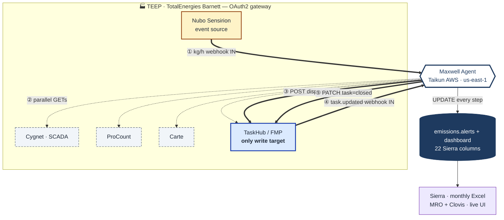

# TEEP Barnett · Architecture Overview (one-pager)

The same architecture as [03-architecture.md §1.1](03-architecture.md) — redrawn so the 5-phase lifecycle reads in one glance. Trust boundaries, system colours, and read/write semantics are unchanged. The supporting tables below restate the chart in plain text for anyone who prefers prose.

---

## 1 · The architecture in one chart

**Legend.**
- 🟨 yellow = event source (Nubo)
- ⬜ dashed grey = read-only API (Cygnet · ProCount · Carte)
- 🟦 blue solid = the one system we write to (TaskHub / FMP)
- ⚪ white-with-navy-outline = Maxwell agent
- ⬛ navy = Taikun-side store + dashboard
- 🟪 purple = downstream consumers

Thick arrows (`==>`) are **writes** or event-source webhooks. Thin dashed arrows (`-.->`) are **reads**. Numbered ①–⑤ trace one complete triage lifecycle.

---

## 2 · The 5 phases, in plain text

| # | Phase | Direction | What happens |
|---|---|---|---|
| ① | **Detect**     | Sensirion → Maxwell                | Sensirion `kg/h ≥ threshold` webhook arrives. Maxwell inserts a new row in `emissions.alerts` (status = Open). |
| ② | **Enrich**     | Maxwell → 4 systems (parallel)     | Maxwell fans out 4 GETs in parallel: Cygnet (pressures, sales, comp metrics), ProCount (down/up codes, operator comments), Carte (injection rate), TaskHub (LO notes around event). |
| ③ | **Dispatch**   | Maxwell → TaskHub                  | For *Unexpected* events, Maxwell POSTs a dispatch task to TaskHub with the full evidence pack. (Auto-close path skips this — UPDATE the alert and end.) |
| ④ | **Field work** | LO → TaskHub → Maxwell             | Lease operator works the task and updates TaskHub. TaskHub fires `task.updated` webhook back to Maxwell. |
| ⑤ | **Close loop** | Maxwell → TaskHub + alert store    | Maxwell PATCHes the TaskHub task closed and finalises the `emissions.alerts` row (`status = Closed`, full Sierra columns populated). |

After ⑤, the populated alert is what Sierra's monthly Excel and the MRO / Clovis dashboards read from. They never touch the live loop.

---

## 3 · Trust boundary — who calls what

| System              | Owner   | Maxwell access            | Purpose                                              |
|---------------------|---------|---------------------------|------------------------------------------------------|
| Nubo Sensirion      | TEEP    | read · webhook in         | event source                                         |
| Cygnet · SCADA      | TEEP    | read-only (GET)           | tubing / line / casing pressure · sales · comp metrics |
| ProCount            | TEEP    | read-only (GET)           | down / up codes · operator comments · work orders    |
| Carte               | TEEP    | read-only (GET)           | injection-rate drop                                  |
| TaskHub / FMP       | TEEP    | read + write (GET · POST · PATCH) | dispatch & close-the-loop                    |
| `emissions.alerts`  | Taikun  | full write                | event lifecycle store (Sierra's 22 columns)          |
| Dashboard / Excel   | Taikun  | read                      | MRO + Clovis (live UI) · Sierra (monthly export)     |

---

## 4 · Why this is safe

- **One write target.** Maxwell's only TEEP-side writes are POST + PATCH against TaskHub. Sensirion, Cygnet, ProCount, and Carte are GET-only.
- **OAuth2 gateway.** All TEEP API calls go through TEEP's OAuth2 client-credentials gateway with rotating tokens — no static keys, no IP allow-listing required.
- **No persisted data outside Taikun.** Raw event cache lives ≤ 7 days; aggregated `emissions.alerts` records are governed by the mutual retention policy.
- **Replayable.** Every Maxwell call writes an audit trace (`/v1/agent/traces/{event_id}`) — every GET, every LLM decision, every POST/PATCH is reconstructable for any past event.

---

*For the original LR flowchart and the sequence-view alternative, see [03-architecture.md §1.1 and §1.2](03-architecture.md). For the full decision tree (rules + actions), see §2.3. For per-system endpoint contracts, see [04-system-integrations.md](04-system-integrations.md).*
